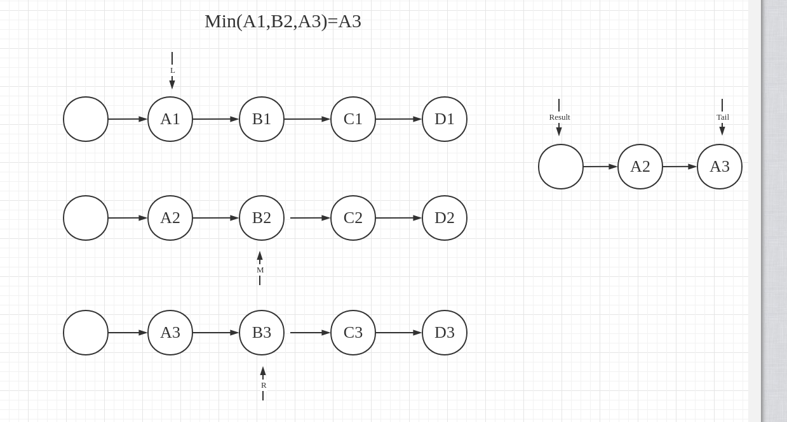

# 题目

给你一个链表数组，每个链表都已经按升序排列。

请你将所有链表合并到一个升序链表中，返回合并后的链表。

# 示例

输入：lists = [[1,4,5],[1,3,4],[2,6]]
输出：[1,1,2,3,4,4,5,6]
解释：链表数组如下：
[
  1->4->5,
  1->3->4,
  2->6
]
将它们合并到一个有序链表中得到。
1->1->2->3->4->4->5->6


输入：lists = []
输出：[]


输入：lists = [[]]
输出：[]

# 思路

## 简单入手：合并两个有序链表

其实这和leetcode21题：合并两个有序链表很相似，只不过21题是本题K=2的场景。不妨来回顾一下合并两个有序链表是怎么做的，假设有1链表和2链表：


有个条件非常重要：这两个链表本身就是有序的，因此先从两个链表按顺序各拿一个节点，比较它们的大小：


那我假设A1＜A2，此时A1是比较小的节点，将它放进Result链表里，注意Result链表本身也是单链表，**为了保证尾插发的效率，需要维护一个Tail节点**。

此时2链表的R指针不用发生挪动，因为它仍是1链表与2链表之间最大的，1链表A1已经被挪出去了，所以L指针往右移动，继续和A2进行比较：


假设B1还是＜A2，就将B1添加到Result链表里，继续挪动Tail和L指针的位置，进行下一次比较：


现在局面发生了好转，C1是＞A2的，A2就要被挪到Result队列，这次轮到L指针不变，需要挪动Tail指针和R指针的位置。

那我现在假设C1和D1都＜B2：


和上面一样，C1和D1都被挪到Result链表里，R指针仍不变，Tail指针指向D1，而L指针因为1链表的遍历完成，顺理成章指向nil。当其中链表被遍历完毕，**直接将另一个链表追加到Result链表上，至此链表合并完成**：


此时R指针仍是指向B2，总的来说就是：

1. L和R比较哪个更大，【比较值小的指针】指向的节点被挪到Result链表（注意维护Tail指针）。
2. 【比较值小的指针】往右挪，【比较值大的指针】保持不变。
3. 当发现其中一个指针指向nil了，说明这个链表已经被遍历完，直接将【另一个指针】指向的链表追加到Result链表。
4. Result链表既是结果。

## 开始变难；如果是合并K个呢？

假设现在是链表1、链表2、链表3，分别使用L、M、R指针。同样还是使用Result和Tail来存放数据：


假设现在A2是最小的，被加进Result：


接下来还是经典的比大小环节，从L、R、M指针选一个最小的，放进Result队列里，不是最小的指针就不要动：


直到还剩下一个链表，就直接将链表追加到Result链表里：


总来说【合并K】与【合并2】没多大区别，也是比较每个链表的节点，将最小值节点挪到Result，并移动最小值节点的指针。只是从【其中一个链表的指针指向nil，将另一个链表直接追加到Result】变成【还剩下一个链表时，将这个链表直接追加到Result】而已。

但它有一个难点：每一次都要从N个节点（N最大值=K）中找到最小的，这就涉及到排序算法了。并且拿到最小值后，下一次比较的数是自己的下一个节点，比如：

第一次比较：Min[A1,A2,A3] = A2

下一次比较：Min[A1,B2,A3] = ?

每一次比较的数据的顺序是不同的，我得把第一次比较结果的最小值拿出来，然后存放一个新值进去再进行比较

**也就是说：每次比较之前乱序数据是不同的，我需要一个比较稳定的排序算法，并且支撑这个算法的数据结构是支持我存、取数据的**。

## 一个合适的数据结构

有没有这么一个数据结构：当我存放数据的时候，它就立刻排好序了；当我拿走一个数据后，它会自动维护有序性；当我再放进一个数据时，它会再次维护好有序性？首先我想到的是红黑树，但结合上面的分析：我只需要找到最小的就好了，并不是想得到严格有序的效果，这不得不提到我昨天学习到的：[最小堆](https://github.com/9029HIME/Algorithm/tree/master/leetCode/20221020_Null_Null_Binary_Heap_Prority_Queue---Data_Struct_Design)

如果采用最小堆来完成，过程就是这样，我们先将LMR指针的节点放进一个最小堆里，假设大小关系是A2<A1<A3：


那么在存放数据的时候，最小堆会自动维护大小，A2称为堆顶节点，即A2已是最小节点，可以放入Result链表里了：


将A2弹出后，堆会自动维护有序性，将更小的A1节点放在堆顶，那么接下来比较A1，A3，B2大小，也是同样的过程。假设A1<A3<B2：


接下来的流程就大同小异了，无非就是维护好每个指针的关系，并且当剩余链表数量=1的时候，直接追加到Result链表上。

# 代码1（合并两个有序链表）

## 节点与链表

先定义好节点和链表，等下在合并K个有序链表时复用：

```go
package main

import "fmt"

/**
链表与节点的定义
*/
type Node struct {
   next *Node
   val  int
}

type SinglyLinkedList struct {
   head *Node
}

/**
初始化有序链表（切片得是有序的）
*/
func InitSinglyLinkedList(values []int) *SinglyLinkedList {
   list := new(SinglyLinkedList)
   list.head = new(Node)

   node := list.head
   for _, v := range values {
      n := new(Node)
      n.val = v
      node.next = n
      node = node.next
   }

   return list
}

/**
获取Result链表
*/
func NewSinglyLinkedList() *SinglyLinkedList {
   list := new(SinglyLinkedList)
   list.head = new(Node)
   return list
}

/**
打印链表结构
*/
func (this *SinglyLinkedList) introduce() {
   result := "head-->"
   node := this.head.next
   for node != nil {
      val := fmt.Sprintf("%v-->", node.val)
      result = result + val
      node = node.next
   }
   result = result[0 : len(result)-3]
   fmt.Println(result)
   fmt.Println()

}
```

## 实际的合并代码

```go
package main

/**
合并两个有序链表的方法
*/
func Merge2SortedLists(l1 *SinglyLinkedList, l2 *SinglyLinkedList) *SinglyLinkedList {
   result := NewSinglyLinkedList()
   tail := result.head

   l := l1.head.next
   r := l2.head.next

   for l != nil && r != nil {
      lVal := l.val
      rVal := r.val
      var minNode *Node

      // 毕竟是单链表，出队操作比较复杂，逻辑出队就好了
      if lVal <= rVal {
         minNode = l
         l = l.next
      } else {
         minNode = r
         r = r.next
      }

      rN := new(Node)
      rN.val = minNode.val
      // 维护tail
      tail.next = rN
      tail = tail.next
   }

   // 走到这 说明已经有一个队列遍历完毕了
   if l == nil {
      tail.next = r
   } else {
      tail.next = l
   }

   return result
}
```

## 单元测试用例

```go
func Test2Lists(t *testing.T) {
   values1 := []int{1, 3}
   values2 := []int{2, 4, 6, 8}

   l1 := InitSinglyLinkedList(values1)
   l2 := InitSinglyLinkedList(values2)

   result := Merge2SortedLists(l1, l2)
   result.introduce()
}
```

# 代码2（合并K个有序链表）

## 基于之前写的[最小堆代码](https://github.com/9029HIME/Algorithm/blob/master/leetCode/20221020_Null_Null_Binary_Heap_Prority_Queue---Data_Struct_Design/SmallHeapQueue.go)进行一点改动

1. 将堆数据从int改成Node
2. 封装一个方法，弹出堆顶数据
3. 当一个heap没有数据时，pop只会返回nil，不会抛异常

```go
package main

import "fmt"

type BinaryHeap struct {
	data     []*Node
	capacity int
	length   int
}

type RiseSink interface {
	rise(i int)
	sink(i int)
}

func (this *BinaryHeap) leftSon(i int) int {
	return i * 2
}

func (this *BinaryHeap) rightSon(i int) int {
	return (i * 2) + 1
}

func (this *BinaryHeap) father(i int) int {
	return i / 2
}

/**
实际交换节点
*/
func (this *BinaryHeap) swap(from int, to int) {
	// 在只有一个堆顶节点，进行删除的时候，有可能会自己与自己换
	if from == to {
		return
	}

	fromValue := this.data[from]
	toValue := this.data[to]
	this.data[to] = fromValue
	this.data[from] = toValue
}

func (this *BinaryHeap) introduce() {
	result := "0->"
	for i, datum := range this.data {
		if i == 0 {
			continue
		}
		if datum == nil {
			break
		}
		val := fmt.Sprintf("%v->", datum.val)
		result = result + val
	}
	fmt.Println(result)
}

func (this *BinaryHeap) put(val *Node, rs RiseSink) {
	if this.length == this.capacity {
		panic("优先级队列已满")
	} else {
		this.data[this.length+1] = val
		rs.rise(this.length + 1)
		this.length++
	}
}

/**
删除下标=i的节点
*/
func (this *BinaryHeap) del(i int, rs RiseSink) {

	if i > this.length {
		return
	}

	to := this.length
	this.swap(i, to)

	this.data[to] = nil
	this.length--

	rs.sink(i)
}

/**
删除堆顶数据，并返回它
*/
func (this *BinaryHeap) pop(rs RiseSink) *Node {
	node := this.data[1]
	this.del(1, rs)
	return node
}

```

```go
package main

import "math"

/**
基于最小堆的优先级队列
*/
type SmallHeapQueue struct {
	BinaryHeap
}

func InitSmallHeapQueue(capacity int) *SmallHeapQueue {
	p := new(SmallHeapQueue)
	// 记得冗余index=0
	p.data = make([]*Node, capacity+1)
	p.capacity = capacity
	p.length = 0
	return p
}

/**
下沉指定下标的节点（最小堆，将大值下沉）
*/
func (this *SmallHeapQueue) sink(i int) {
	// 既然要下沉，那就找最大
	lI := this.leftSon(i)
	rI := this.rightSon(i)
	if lI > this.length && rI > this.length {
		// 已经是叶子节点了
		return
	}

	// 有可能左节点为空，也有可能右节点为空，这时候要做好兜底处理
	leftNode := this.data[lI]
	rightNode := this.data[rI]
	var left int
	var right int
	if leftNode == nil {
		left = math.MaxInt
	} else {
		left = leftNode.val
	}
	if rightNode == nil {
		right = math.MaxInt
	} else {
		right = rightNode.val
	}

	var max int
	var maxI int
	if left <= right {
		max = left
		maxI = lI
	} else {
		max = right
		maxI = rI
	}
	// 得和最大的子节点进行比较，如果小于它，就和它swap
	val := this.data[i].val
	if val > max {
		this.swap(i, maxI)
	} else {
		// 出口
		return
	}
	this.sink(maxI)
}

/**
上升指定下标的节点（最小堆，将小值上升）
*/
func (this *SmallHeapQueue) rise(i int) {
	fI := this.father(i)
	if fI == 0 {
		// 说明已经在堆顶了
		return
	}
	val := this.data[i].val
	father := this.data[fI].val
	if father > val {
		this.swap(i, fI)
	} else {
		// 递归出口
		return
	}
	// 此时节点就在father所在的下标了
	this.rise(fI)
}

func (this *SmallHeapQueue) put(val *Node) {
	this.BinaryHeap.put(val, this)
}

func (this *SmallHeapQueue) del(i int) {
	this.BinaryHeap.del(i, this)
}

func (this *SmallHeapQueue) pop() *Node {
	pop := this.BinaryHeap.pop(this)
	return pop
}

```

## 实际的合并代码

```go
package main

func MergeKSortedLists(lists []*SinglyLinkedList) *SinglyLinkedList {
   heap := InitSmallHeapQueue(len(lists))
   result := NewSinglyLinkedList()
   tail := result.head

   for _, v := range lists {
      //直接第一个节点放到最小堆里
      first := v.head.next
      heap.put(first)
   }

   pop := heap.pop()
   var nextAdd *Node

   for pop != nil {
      tail.next = pop
      tail = tail.next
      nextAdd = pop.next
      if nextAdd != nil {
         heap.put(nextAdd)
      }
      pop = heap.pop()
   }
   return result
}
```

## 单元测试用例

```go
func TestKLists(t *testing.T) {
   values1 := []int{1, 3, 5, 7, 9}
   values2 := []int{2, 4, 6, 8}
   values3 := []int{11, 13, 15, 17, 19}
   values4 := []int{10, 12, 14, 16, 18}

   l1 := InitSinglyLinkedList(values1)
   l2 := InitSinglyLinkedList(values2)
   l3 := InitSinglyLinkedList(values3)
   l4 := InitSinglyLinkedList(values4)

   lists := []*SinglyLinkedList{l1, l2, l3, l4}

   result := MergeKSortedLists(lists)
   result.introduce()
}
```

# 和一开始思路不太一致的地方

可以看到，我并没有维护K个链表的K个指针，而已一开始就将三个链表的头节点放到最小堆里

当选出最小节点时，我会检查最小节点的next是否为nil，如果不为nil则将next放到最小堆里

当一个链表已经被遍历完了，那它的节点肯定是经历过最小堆的，要么还存在于最小堆、要么早就已经追加到Result上了

**也就是说：没必要等到剩下一个链表，再直接append到Result上，也没必要维护每个队列的指针。只需要知道，当最小堆没有数据时，K个链表的合并就结束了。**


