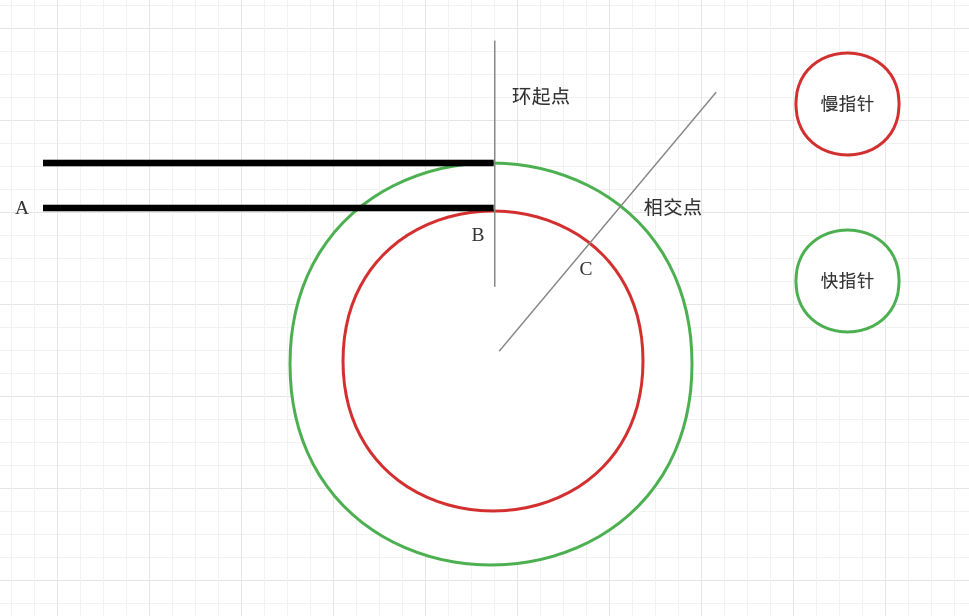

# 题目

给定一个链表的头节点  head ，返回链表开始入环的第一个节点。 如果链表无环，则返回 null。

如果链表中有某个节点，可以通过连续跟踪 next 指针再次到达，则链表中存在环。 为了表示给定链表中的环，评测系统内部使用整数 pos 来表示链表尾连接到链表中的位置（索引从 0 开始）。如果 pos 是 -1，则在该链表中没有环。注意：pos 不作为参数进行传递，仅仅是为了标识链表的实际情况。

**不允许修改** 链表。

# 思路

这道题和[环形链表](https://leetcode.cn/problems/linked-list-cycle/)很像，环形链表是通过快慢指针，来判断链表是否有环，但是这道题目要你找出环的起点。

现在的问题是：通过快慢指针找到的，顶多是**证明有环的相交点**。基于这个相交点，该如何找到环的起点？又或者说，能否找到？

在网上的文章，我找到一篇比较好的思路，其中使用了数形结合的思想，在说这个思路之前，首先得明确一个概念：

**通过快慢指针来遍历链表，且规定慢指针走1步，快指针走2步；无论何时，快指针遍历的链表长度 = 慢指针遍历的链表长度 × 2（也是通过这个特性，来完成[链表的中间结点](https://leetcode.cn/problems/middle-of-the-linked-list/)这道题）**

有了这个前置概念，我来画一个图，表示快慢指针在链表上的遍历情况：



1. 红圈和绿圈的半径是一样的，都是同一个链表的遍历结果，为了方便区分才画一大一小

2. 慢指针走了AC长度，才和快指针相遇。此时快指针已经走了2AC的长度，并且在环里绕了一圈，**也就是说：2AC = AC + CC，CC=AC，即环的周长 = AC（这个结论是本题解题的核心，必须要好好理解）**

3. 要得到环的起点，就是要AB的位置（长度），AB = AC - BC，CB = 周长 - BC，也就是说 AB = CB

4. 也就是说，当发现快慢指针相交后，将慢指针重新挪到A点（起始点），然后让两个指针**同速前进**，那么下一次相交的点就是B点，也就是环的起点了

# 代码

理论有了，接下来就是代码

```go
package main

import (
   "fmt"
   "strconv"
)

func main() {
   head := new(ListNode)
   one := &ListNode{
      Val: 1,
   }
   two := &ListNode{
      Val: 2,
   }
   three := &ListNode{
      Val: 3,
   }
   four := &ListNode{
      Val: 4,
   }
   five := &ListNode{
      Val: 5,
   }

   // 连接链表
   head.Next = one
   one.Next = two
   two.Next = three
   three.Next = four
   four.Next = five

   // 环的起点
   five.Next = two

   fmt.Println(detectCycle(head))
}

// 还是那句话：第一个节点是哑节点
type ListNode struct {
   Val  int
   Next *ListNode
}

func (this *ListNode) String() string {
   return strconv.Itoa(this.Val)
}

func detectCycle(head *ListNode) *ListNode {
   var result *ListNode = nil
   var intersection *ListNode = nil

   slow := head
   fast := head

   for slow != nil && fast != nil {
      slow = slow.Next
      fast = fast.Next
      // 说明没环，快指针已经到尾了
      if fast == nil {
         return nil
      }
      fast = fast.Next
      // 找到相交点了，别再循环了
      if slow == fast {
         intersection = slow
         break
      }
   }

   fmt.Println(intersection)

   // 既然有相交点，那就重置慢指针，同速执行
   if intersection != nil {
      slow = head
      // 能走到这一步，说明必定有环，就不用考虑nil情况了
      for slow != fast {
         slow = slow.Next
         fast = fast.Next
      }
      result = slow
   }

   return result
}
```