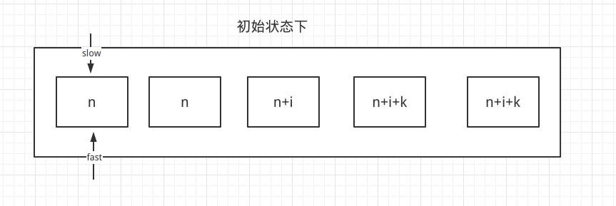
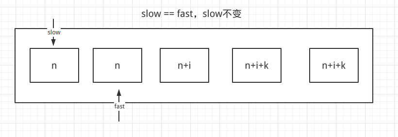
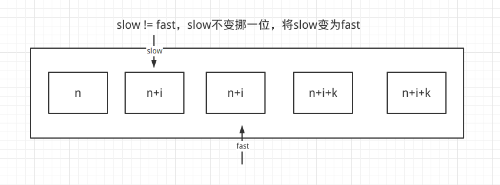
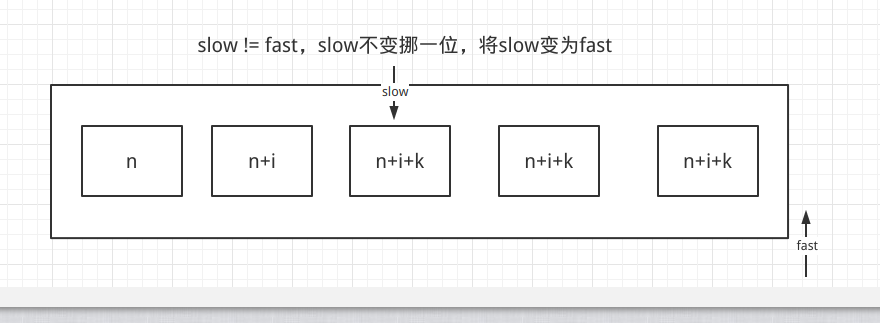

# 题目

给你一个 升序排列 的数组 nums ，请你 原地 删除重复出现的元素，使每个元素 只出现一次 ，返回删除后数组的新长度。元素的 相对顺序 应该保持 一致 。

由于在某些语言中不能改变数组的长度，所以必须将结果放在数组nums的第一部分。更规范地说，如果在删除重复项之后有 k 个元素，那么 nums 的前 k 个元素应该保存最终结果。

将最终结果插入 nums 的前 k 个位置后返回 k 。

不要使用额外的空间，你必须在 原地 修改输入数组 并在使用 O(1) 额外空间的条件下完成。

# 示例

输入：nums = [1,1,2]
输出：2, nums = [1,2,_]
解释：函数应该返回新的长度 2 ，并且原数组 nums 的前两个元素被修改为 1, 2 。不需要考虑数组中超出新长度后面的元素。


输入：nums = [0,0,1,1,1,2,2,3,3,4]
输出：5, nums = [0,1,2,3,4]
解释：函数应该返回新的长度 5 ， 并且原数组 nums 的前五个元素被修改为 0, 1, 2, 3, 4 。不需要考虑数组中超出新长度后面的元素。

# 思路

我一开始看到这个题目，下意识就是：新建一个数组，将结果去重并放到新数组那，但题目要求我原地修改，这让我犯了难，不过居然题目有特殊要求，说明是有突破点的。

首先我想到的就是“升序”，如果一个数组是升序数组，并且它是有重复项的话，那么重复的值必须是紧挨在一起的，也就是[n,n,n+i,n+i,n+i+k,n+i+k]这样类似的组合。

其次，题目要我输出去重后的数据长度，并且只会输出数组内【截止数据长度】的数据，以上面的用例来看，题目似乎想要[n,n,n+i,n+i,n+i+k,n+i+k] → 3,[n,n+i,n+i+k]，并且题目不关心index = 4之后的长度。

那么在处理过程中，我不仅要去重，我还得覆盖数组内数据的值，我首先想到的就是**快慢指针**。



初始状态，slow和fast都指向index = 0



挪动fast，如果fast == slow，slow保持不动



如果fast != slow，说明有新的数据，将slow挪动一位，并且slow赋值fast



直到fast遍历结束

**也就有序顺序表才敢这样玩，但凡它是乱序的都不行。**

# 代码

```go
package main

func main() {
   nums := []int{0, 0, 1, 1, 1, 2, 2, 3, 3, 4}
   println(removeDuplicates(nums))
}

func removeDuplicates(nums []int) int {
   length := len(nums)
   if length == 0 {
      return -1
   }

   slow := 0
   fast := 0

   for fast < length {

      sE := nums[slow]
      fE := nums[fast]

      if sE != fE {
         slow++
         nums[slow] = fE
      }
      fast++
   }

   return slow + 1
}
```