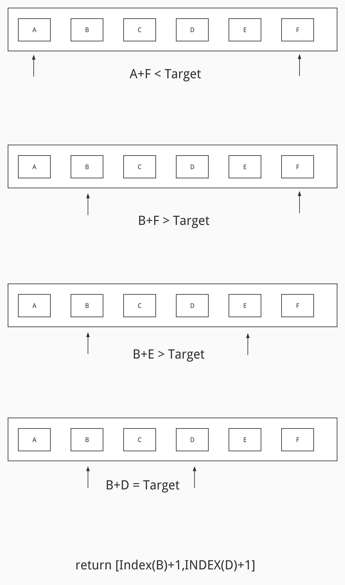

# 题目

给你一个下标从 1 开始的整数数组 numbers ，该数组已按 非递减顺序排列  ，请你从数组中找出满足相加之和等于目标数 target 的两个数。如果设这两个数分别是 numbers[index1] 和 numbers[index2] ，则 1 <= index1 < index2 <= numbers.length 。

以长度为 2 的整数数组 [index1, index2] 的形式返回这两个整数的下标 index1 和 index2。

你可以假设每个输入 只对应唯一的答案 ，而且你 不可以 重复使用相同的元素。

你所设计的解决方案必须只使用常量级的额外空间。

# 示例

输入：numbers = [2,7,11,15], target = 9
输出：[1,2]
解释：2 与 7 之和等于目标数 9 。因此 index1 = 1, index2 = 2 。返回 [1, 2] 。


输入：numbers = [2,3,4], target = 6
输出：[1,3]
解释：2 与 4 之和等于目标数 6 。因此 index1 = 1, index2 = 3 。返回 [1, 3] 。


输入：numbers = [-1,0], target = -1
输出：[1,2]
解释：-1 与 0 之和等于目标数 -1 。因此 index1 = 1, index2 = 2 。返回 [1, 2] 。

# 思路

其实看到递增的顺序表，应该养成**优先考虑双指针**的习惯。考虑到它是递增的，我可以先选取数组最小的数和最大的数进行求和。

如果 和＞期望值，说明最大数偏大，将指针往前移，取一个更小的值，进行下一次比较。

如果 和 < 期望值，说明最小数偏小，将指针往后移，取一个更大的值，进行下一次比较。

题目已经告诉我们一定有解，且解只有一个，所以没必要考虑临界情况，落实到具体流程图如下：



# 代码

```go
package main

import "fmt"

func main() {
   indices := twoSum([]int{2, 7, 11, 15}, 9)
   for _, index := range indices {
      fmt.Println(index)
   }
}

func twoSum(numbers []int, target int) []int {
   length := len(numbers)
   if length < 2 {
      return nil
   }

   left := 0
   right := length - 1

   for left != right {
      vL := numbers[left]
      vR := numbers[right]
      tmp := vL + vR
      if tmp == target {
         // 注意题目要的是index + 1
         return []int{left + 1, right + 1}
      } else if tmp > target {
         right--
      } else {
         left++
      }
   }

   return nil
}
```