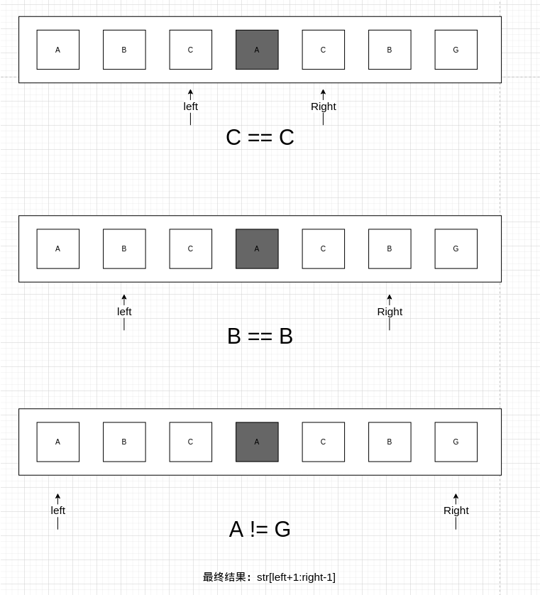
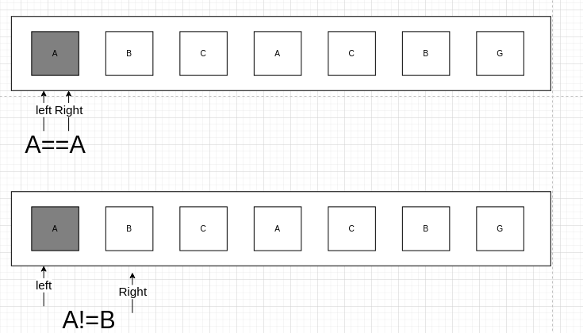
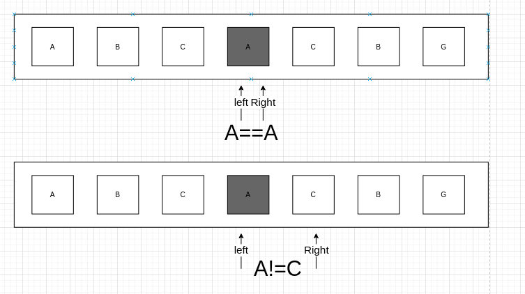

# 题目

给你一个字符串 `s`，找到 `s` 中最长的回文子串

# 示例

```
输入：s = "babad"
输出："bab"
解释："aba" 同样是符合题意的答案。
```

```
输入：s = "cbbd"
输出："bb"
```

# 思路

## 根据什么找回文？

题目想要字符串内的**最长回文**，也就是说串内可能有多个回文，我还得从中选取最长的一个。

滑动窗口可行吗？用双指针滑动窗口，好像不行，我无法判断左指针到右指针是真的没有回文，还是没有到回文？

而且假设左指针和右指针确定了BCCB这样的回文，万一后面还有BCCB组成 BCCBBCCB呢？我不能因为右指针的值和左指针一样，就停止遍历了，我还得继续遍历下去。换句话说：**回文的确定不能根据左右指针滑动进行，而是需要一个中间点向外扩散。**

我想到一个比较笨的方法：先将串内的每一个字符作为中间点，向外扩散获得**以这个字符为中点的最长回文**，再将所有回文进行比较，选取最长的那一份返回。伪代码是：

```
string result = ""
for _,s := range str{
	// 获得以s为中间的最长回文
	p = getPalindromic(s)
	if len(p) > result{
		result = p
	}
}
return result
```

## 怎么根据中间字符，找最长回文？

那么问题又来了，我怎么找到一个中间字符的最长回文呢？假设中间字符为c，我需要两个指针，左指针指向c的左字符，右指针指向c的右字符。

如果左 == 右，起码c的左右和c能组成一个回文，但不一定是最长的，于是得将左指针继续往左移，右指针继续往右移，直到左 不等于 右，**此时上一个左右指针范围就能确定c的最长回文**。

对应的流程图如下，假设有这么一个字符ABCACBG，我以中间的A为中心，找它的最长回文：



## 还得考虑回文的一个特性：双中间字符

**其实这是对称的特性**，对称结构体可以有一个中点，也可以有两个中点，比如BCACB是一个回文，中间字符是A。但BCAACB同样也是一个回文，中间字符是AA。

那双中间字符该怎么找回最长回文？其实没必要纠结这一点，可以将两个中间字符当成一个中间字符来看待，继续走上面的逻辑就好了，就是伪代码得改一下了：

```
string result = ""
for i,_ := range str{
	// 获得以str[i]为中间字符的最长回文
	p1 = getPalindromic(i,i)
	// 获得以str[i]+str[i+1]为中间字符的最长回文
	p2 = getPalindromic(i,i+1)
	if len(p1) > result{
		result = p1
	}
	if len(p2) > result{
		result = p2
	}
}
return result
```

其中方法参数的i和i分别代表left和right指向的下标。

如果以上面ABCACBG，以**第一个**A为中心的用例为准，那么流程**起始状态**是这样的：



以**第二个**A为中心的用例为准，那么流程**起始状态**是这样的：




# 代码

```go
func longestPalindrome(s string) string {
   result := ""
   for i, _ := range s {
      p1 := getPalindromic(s, i, i)
      p2 := getPalindromic(s, i, i+1)
      if len(p1) > len(result) {
         result = p1
      }
      if len(p2) > len(result) {
         result = p2
      }
   }
   return result
}

/**
根据left和right定位中间字符，返回这个中间字符的最大回文
*/
func getPalindromic(str string, left int, right int) string {
   length := len(str)

   for left >= 0 && right <= length-1 && str[left] == str[right] {
      left--
      right++
   }

   // 能走到这一步，说明left和right的值 或者其代表的字符 已经不符合要求了

   // 在golang里，也是包左不包右的
   return str[left+1 : right]
}
```