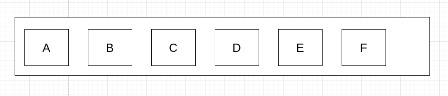
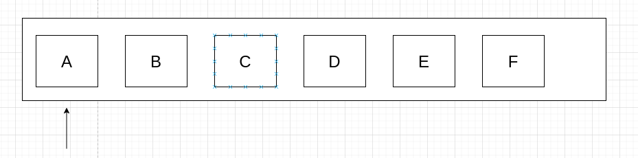

# 题目

给你一个整数数组 nums ，找到其中最长严格递增子序列的长度。

子序列 是由数组派生而来的序列，删除（或不删除）数组中的元素而不改变其余元素的顺序。例如，[3,6,2,7] 是数组 [0,3,1,6,2,2,7] 的子序列。

# 示例

```
输入：nums = [10,9,2,5,3,7,101,18]
输出：4
解释：最长递增子序列是 [2,3,7,101]，因此长度为 4 。
```

```
输入：nums = [0,1,0,3,2,3]
输出：4
```

```
输入：nums = [7,7,7,7,7,7,7]
输出：1
```

# 思路

既然要你找到最长**递增**子序列的长度，那说明原来的数据本身就不是递增的，甚至是乱序的。假设有这么一个数组（虽然用A-F来代替值，但不代表它是有序的）：



截止到A，毕竟它是第一个元素，A的最长递增子序长度是MaxLength(A) = 1：



那如果截止到B呢？MaxLength(B)的值得看分两种情况：

	1. A≤B：MaxLength(A) + 1
	1. A>B：1

到这一步还是挺好理解的，那如果截止到C呢？我先穷举一下：

​	假设A≤B≤C，那么MaxLength(C)应该是3，也就是MaxLength(B) + 1

​	假设A≤C≤B，那么MaxLength(C)应该是2，也就是MaxLength(A) + 1

​	假设C≤A≤B，那么MaxLength(C)应该是1

如果到D呢？我总不能还是按照上面的穷举进行比较吧？或许可以换个思路：遍历截止到D，并且＜D的数据，在它们的MaxLength中挑选一个最大的，进行+1操作。毕竟题目要的是有序的、递增的、最大的子序列长度；通过＜D保证有序递增性，通过前面数据的MaxLength的最大值保证最大性就好了。总的来看时间复杂度是O(N²)。

想找到MaxLength(C)，得先找到MAX[MaxLength(A),MaxLength(B)]，想要找到MaxLength(D)，得先找到MAX[MaxLength(A),MaxLength(B),MaxLength(C)]。这种**每次计算都要获取上一次计算的结果**，我只能想到动态规划了，来思考一下这道题的DP三要素：

1. 选择带来的状态：选了num[i]，需要得到截止num[i]并且＜num[i]的最大MaxLength值
2. DP出口：MaxLength(nums[0])的值 = 1
3. DP数组：dp[i] = MaxLength(nums[i])

# 代码

