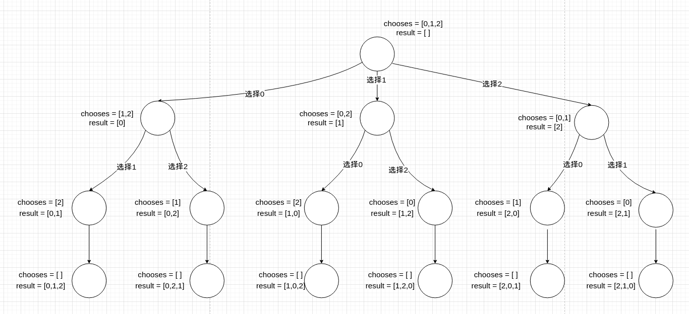
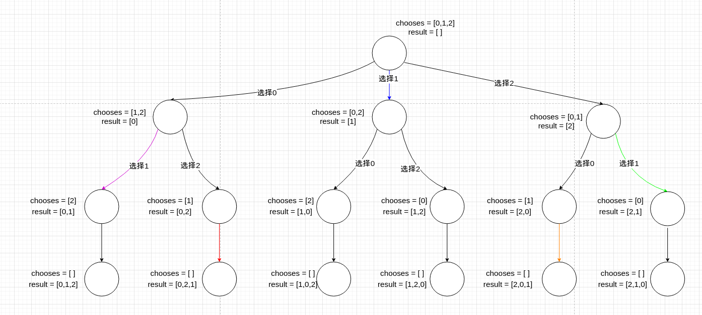
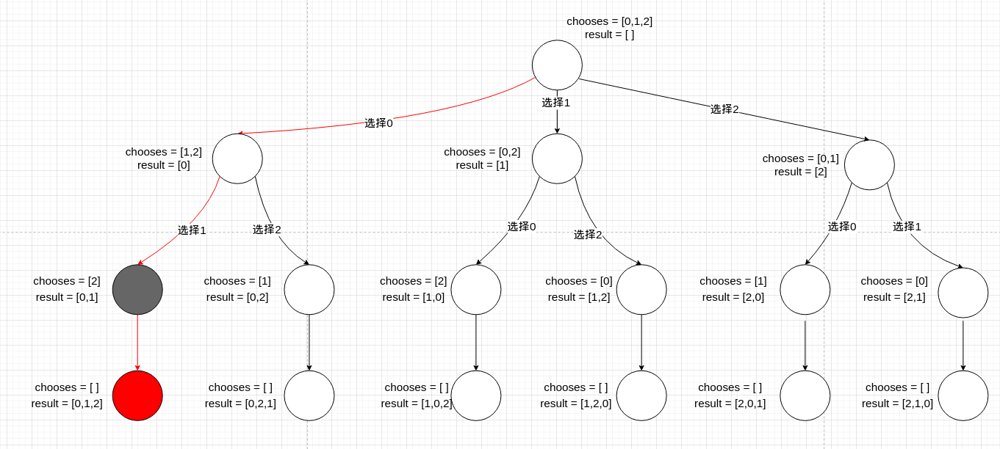
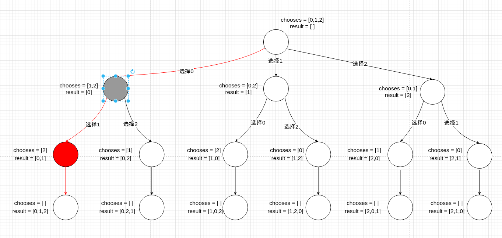
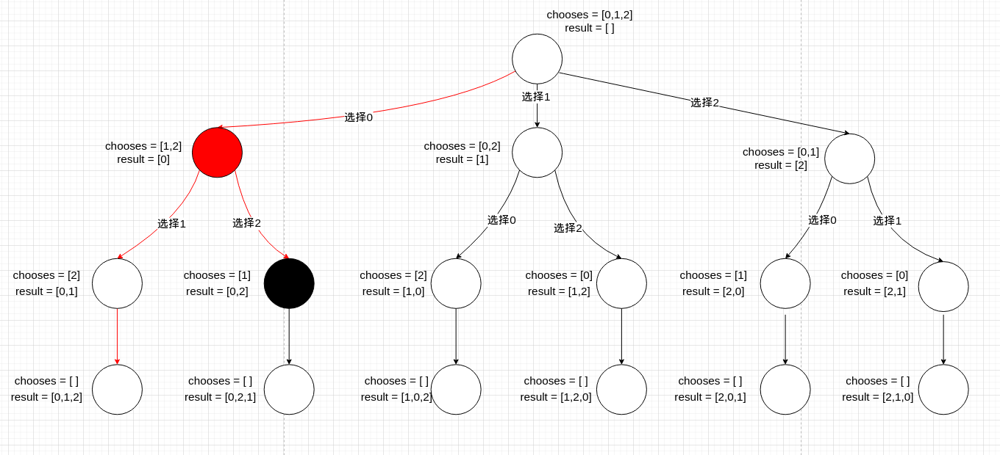
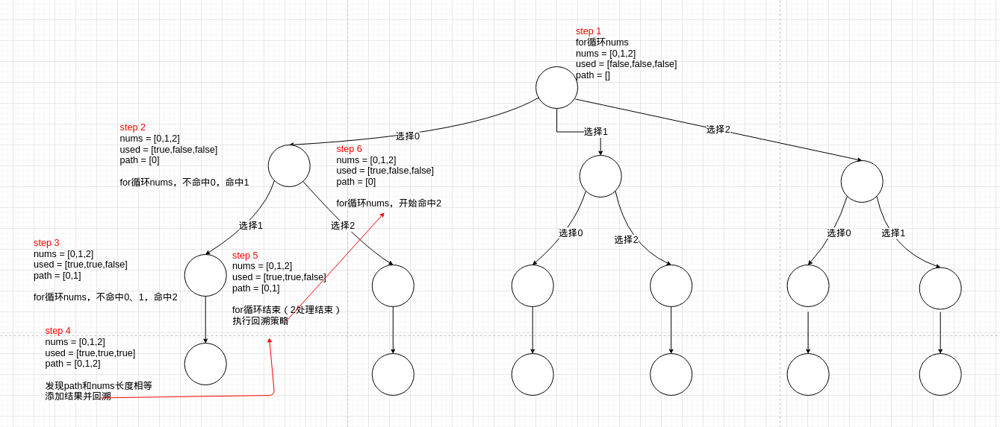

# 题目

给定一个不含重复数字的数组 `nums` ，返回其 *所有可能的全排列* 。你可以 **按任意顺序** 返回答案。

# 示例

```
输入：nums = [1,2,3]
输出：[[1,2,3],[1,3,2],[2,1,3],[2,3,1],[3,1,2],[3,2,1]]
```

```
输入：nums = [0,1]
输出：[[0,1],[1,0]]
```

```
输入：nums = [1]
输出：[[1]]
```

# 思路

## 算法选型

这种排列组合的题型，优先考虑基于决策树来做，通过简单的for循环是无法完成排列组合的，毕竟for循环是按顺序遍历。基于决策树有2种解题方案：动态规划、回溯，深度优先遍历不算（DFS是遍历树节点，而不是树枝）。基于用例[0,1,2]先画出决策树：



感觉和[零钱余额](https://github.com/9029HIME/Algorithm/tree/master/leetCode/20221007_322_Coin_Change)有点像，那么DP可不可以做？其实就是考虑这棵树能不能剪枝。以下彩色的树枝都是选择1的枝，但是不能把它剪掉：



虽然树枝相同，**但树枝带来的result却不同，不满足剪枝条件**。观察整颗决策树可以发现，每一次选择带来的result都不相同，因此DP不适合。**对于这种枝叶没有重复项的决策树应该采用回溯算法，而不是动态规划**。

## 算法落实

那问题来了，怎么用回溯算法来遍历这颗决策树呢？回忆一下回溯算法的三要素：

1. 回溯出口：当遍历到叶子节点，说明当前路径已遍历完。
2. 选择：根据哪一条树枝进行下一步操作。
3. 回退：到达回溯出口后，需要回退到上一次选择，然后走另一条树枝。

回溯算法三要素落实到这道题，可以看以下步骤：



1. 通过前序遍历（红色线为遍历过程），遍历到红色节点，发现已经没有chooses，代表是叶子节点。
2. 将result作为结果之一，添加到返回值里。
3. 将chooses和result回退到上一个选择，即灰色节点。



1. 同理，上一个灰色节点作为红色节点，发现chooses只剩下2，2的路径已经走过了，代表红色节点已经没有路径可走。
2. 将result和chooses回退到上一个选择，即灰色节点。



1. 上一个灰色节点作为红色节点，chooses剩下1和2，1已经走过了，还有2没走。
2. 于是走2的树枝，继续进行遍历。

**最终得到[0,2,1]的结果后，会按照上面的步骤，继续回溯到chooses=[0,2]的节点上继续遍历，最终将所有叶子节点的结果都遍历完。**

## 代码落实

理论上是这么走，但落实到代码却不是那么简单了。

1. 我通过bool数组used来维护当前节点已经走过的选择。used[i] = true代表当前节点下，num[i]已经走过了。
2. 发现叶子节点（路径数组长度 = nums长度）后，将叶子节点的结果加入返回值内。执行回退策略。
3. 回退策略：将路径数组最后一个选择删掉，将used[i]重置为false。保留路径数组 和 used给上一个节点。

以上面算法落实的例子进行代码落实的话，流程图就变成这样了：



# 代码

```go
package main

import "fmt"

func main() {
   nums := []int{0, 1, 2}
   result := permute(nums)
   fmt.Println(result)
}

func permute(nums []int) [][]int {
   length := len(nums)
   used := make([]bool, length)
   // 记得要指定切片的长度、再指定容量,否则会初始化[0,0,0]，而不是[]，这里踩了一个基础坑
   path := make([]int, 0, length)
   result := make([][]int, 0, length)
   backtracking(nums, used, path, &result)
   return result
}

func backtracking(nums []int, used []bool, path []int, result *[][]int) {
   lenght := len(path)
   if lenght == len(nums) {
      // 已经到达叶子节点了，代表已存在一个结果
      leaf := make([]int, 0, lenght)
      for _, v := range path {
         leaf = append(leaf, v)
      }
      *result = append(*result, leaf)
      return
   }
   for i, v := range nums {
      if used[i] == true {
         // 这个数字在选择路径上已经使用过了
         continue
      }
      path = append(path, v)
      used[i] = true
      backtracking(nums, used, path, result)
      // 回退策略
      used[i] = false
      path = path[0:lenght]
   }
}
```

