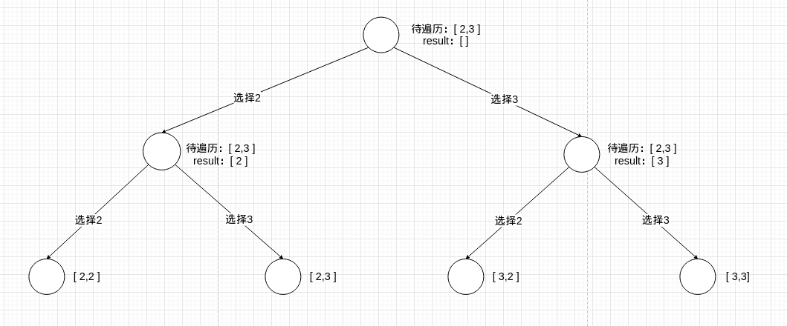
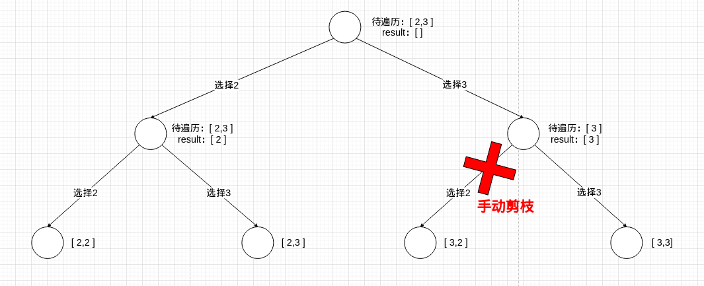

# 题目

给你一个 **无重复元素** 的整数数组 `candidates` 和一个目标整数 `target` ，找出 `candidates` 中可以使数字和为目标数 `target` 的 所有 **不同组合** ，并以列表形式返回。你可以按 **任意顺序** 返回这些组合。

`candidates` 中的 **同一个** 数字可以 **无限制重复被选取** 。如果至少一个数字的被选数量不同，则两种组合是不同的。 

对于给定的输入，保证和为 `target` 的不同组合数少于 `150` 个。

# 示例

```
输入：candidates = [2,3,6,7], target = 7
输出：[[2,2,3],[7]]
解释：
2 和 3 可以形成一组候选，2 + 2 + 3 = 7 。注意 2 可以使用多次。
7 也是一个候选， 7 = 7 。
仅有这两种组合。
```

```
输入: candidates = [2,3,5], target = 8
输出: [[2,2,2,2],[2,3,3],[3,5]]
```

```
输入: candidates = [2], target = 1
输出: []
```

# 思路

现在看到这个**排列组合**相关的题目，第一反应就是想到回溯，但也有可能是DP，试着分析一下：

1. 能做什么选择？答：从数组里选择一个数字。
2. 选择带来的影响是什么？答：接下来的选择会受限，因为已选择数的和要求等于target。
3. 选择带来的**决策树节点**，能否剪掉？答：不能，因为题目要求得到**排列组合**，既然是排列组合，结果需要记录每一步选择。

在[全排序](https://github.com/9029HIME/Algorithm/tree/master/leetCode/20221110_MEDIUM_46_Permutations---Backtracking)这道题里，我提出过一个解释：对于这种枝叶没有重复项的决策树应该采用回溯算法，而不是动态规划。

毕竟这道题，要是将**找出所有不同组合**变成**最少的组合数**，就是换皮的[零钱兑换](https://github.com/9029HIME/Algorithm/tree/master/leetCode/20221007_322_Coin_Change)问题。

所以我得出一个暂定的结论：对于获取**排序组合**这类决策树问题，选择回溯算法；对于获取**最小选择数**这类决策问题，选择动态规划。

既然确定是回溯算法，那就分析一下这道题的回溯三要素吧：

1. 选择：选择哪一个数？如果发现选择数和已选数的和＞7，则需要跳到下一个。
2. 回溯出口：
   1. 选择数和已选数的和＝7
   2. 当前选择数已用完
3. 回溯逻辑：
   1. 如果**本次**还有选择数可选，则判断**本次**的下一个选择是否可选？如果是，继续走选择逻辑。
   2. 如果**本次**选择数耗尽，则将上一次选择作为**本次**，继续走回溯逻辑。

## 错误示范

这是我第一套代码：

```go
func main() {
	candidates := []int{2, 3, 6, 7}
	target := 7
	results := combinationSum(candidates, target)
	fmt.Println(results)
}

func combinationSum(candidates []int, target int) [][]int {
   length := len(candidates)
   results := make([][]int, 0, length)
   path := make([]int, 0, length)
   backTracking(candidates, target, 0, path, &results)
   return results
}

func backTracking(candidates []int, target int, existSum int, path []int, results *[][]int) {
   // 先定义回溯出口
   length := len(path)
   if existSum == target {
      result := make([]int, 0, length)
      for _, v := range path {
         result = append(result, v)
      }
      *results = append(*results, result)
      return
   }

   for i := range candidates {
      v := candidates[i]
      if existSum+v > target {
         continue
      }
      path = append(path, v)
      existSum = existSum + v
      backTracking(candidates, target, existSum, path, results)
      // 回溯策略
      path = path[0:length]
      existSum = existSum - v
   }
}
```

结果输出的是[[2 2 3] [2 3 2] [3 2 2] [7]]，但题目要求的是：如果至少一个数字的被选数量不同，则两种组合是不同的。 也就是说[2 2 3]和[2 3 2]本质是同一组结果，那我该如何去掉重复但乱序的结果呢？以[2 3]，target = 5为例画一颗决策树：



其中[2,2]和[3,3]会因为到达回溯出口2而自动剪枝，按照题目的意思，应该只返回[2,3]，如果以上面的代码执行，估计是返回[2 3] [3,2]，显然不符合题意。

观察整颗决策树可以发现，出现[3,2]的原因是**从3开始又重新扫描2导致的**，既然要从3开始扫描2，说明前面已经经历过从2开始扫描3了，所以没必要从3开始扫描2，所以[3,2]这根枝需要手动剪掉，即**递归开始时，以上一期遍历的终点为起点，开始遍历**


# 代码

```go
package main

import "fmt"

func main() {
   candidates := []int{2, 3, 6, 7}
   target := 7
   results := combinationSum(candidates, target)
   fmt.Println(results)
}

func combinationSum(candidates []int, target int) [][]int {
   length := len(candidates)
   results := make([][]int, 0, length)
   path := make([]int, 0, length)
   backTracking(candidates, target, 0, path, 0, &results)
   return results
}

func backTracking(candidates []int, target int, existSum int, path []int, start int, results *[][]int) {
   // 先定义回溯出口
   length := len(path)
   if existSum == target {
      result := make([]int, 0, length)
      for _, v := range path {
         result = append(result, v)
      }
      *results = append(*results, result)
      return
   }
   
    // 从上一次的终点开始遍历
   for i := start; i < len(candidates); i++ {

      v := candidates[i]
      if existSum+v > target {
         continue
      }
      path = append(path, v)
      existSum = existSum + v
       // 从上一次的终点开始遍历
      backTracking(candidates, target, existSum, path, i, results)
      // 回溯策略
      path = path[0:length]
      existSum = existSum - v
   }
}
```