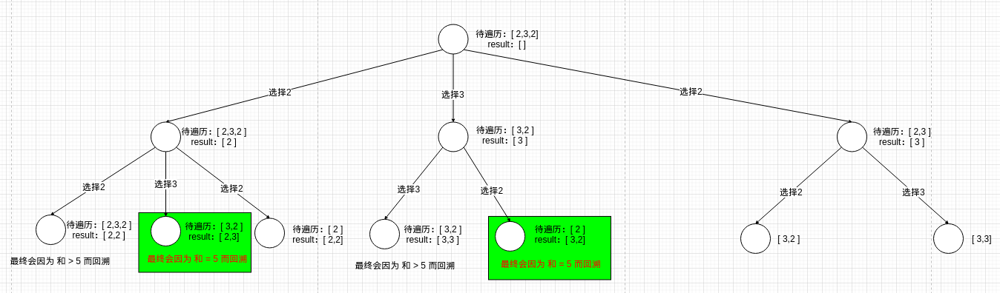
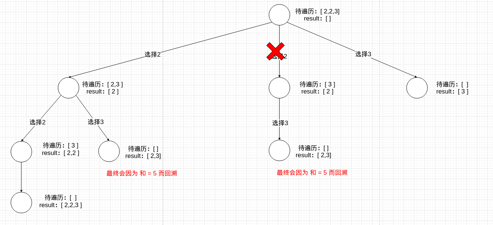
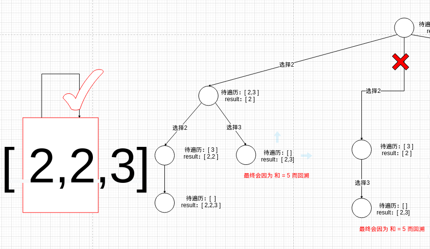
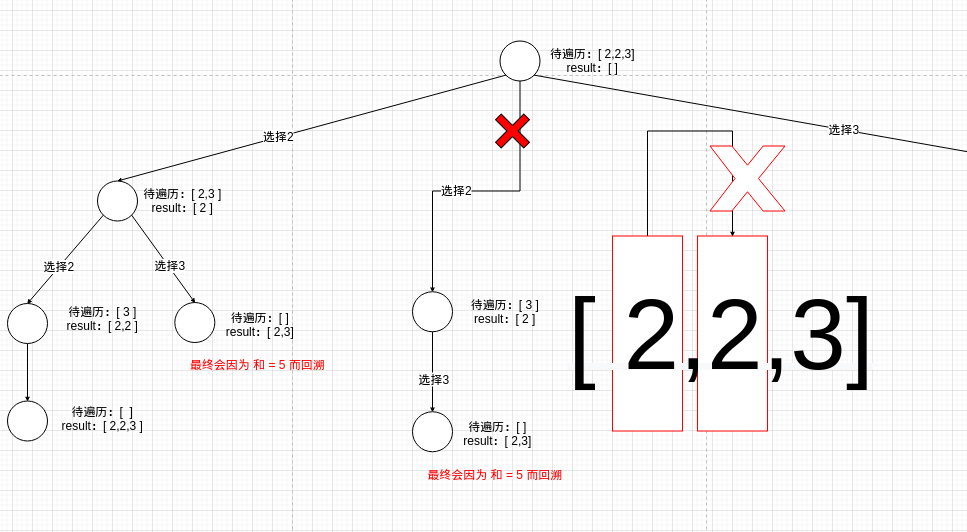

# 题目

给定一个候选人编号的集合 `candidates` 和一个目标数 `target` ，找出 `candidates` 中所有可以使数字和为 `target` 的组合。

`candidates` 中的每个数字在每个组合中只能使用 **一次** 。

**注意：**解集不能包含重复的组合。 

# 示例

```
输入: candidates = [10,1,2,7,6,1,5], target = 8,
输出:
[
[1,1,6],
[1,2,5],
[1,7],
[2,6]
]
```

```
输入: candidates = [2,5,2,1,2], target = 5,
输出:
[
[1,2,2],
[5]
]
```

# 思路

这道题是[组合总和](https://github.com/9029HIME/Algorithm/tree/master/leetCode/20221114_MEDIUM_39_Combination_Sum---Backtracking)的变种，和组合总和不同的是：本题要求**每个数字在每个组合中只能使用一次 ，**candidates里面的数据是可能重复的。

回顾一下[组合总和](https://github.com/9029HIME/Algorithm/tree/master/leetCode/20221114_MEDIUM_39_Combination_Sum---Backtracking)，采用**递归开始时，以上一期遍历的终点为起点，开始遍历**的方式，达到**可以重复选择自己，但不能重复选择前面的数字**的效果。即[2,3,4]、7可以选择[2,2,3]，但不能选择[3,2,2]。

既然本题要求每个数字在组合中只能使用一次，那干脆不允许重复选择自己。将上一次遍历的终点+1为起点，开始遍历。但是！！！以[10,1,2,7,6,1,5],target = 8为例，最终会得到[[1 2 5] [1 7] [1 6 1] [2 6] [2 1 5] [7 1]]的解。

不对啊，明明以终点+1为起点了，为什么还会得到[1,2,5]和[2,1,5]这样的重复解？可别忘了题目里的数据是包含重复的，上面的做法只能保证2不会选择前面的1和自己，**但无法保证2不会选择后面的1**。

再次查看了一下题目，我发现解集没有要求按原顺序，并且看了一下示例，[10,1,2,7,6,1,5]应该是[1,6,1]的顺序，但解集里却是[1,1,6]。有没有一种可能，我可以通过预排序的方式将重复数字挨在一起，然后再去重呢？

落实到代码上，这个思路是正确的，首先要保证遍历起点是上一次遍历的终点+1，然后判断**for循环第n次拿到的值**和**for循环第n-1次拿到的值**是否相等，如果相等则走continue逻辑进行剪枝，要注意for循环第一次取值的边界问题。

落实到决策树的话，以[2,3,2]，target=5为例，如果还是以组合总和的思路去解的话，会这样(节选）：



会产生[2,3]和[3,2]的结果。如果进行预排序后再回溯，并将上一次遍历终点(index=0)+1为起点(index=1)进行遍历，那么决策树会是这样：



问题得到解决。

## 本题核心

为了防止我过段时间后，再看这套题懵逼，直接下一个定义：

0. 以[2,3,3]，target = 5为例。

1. 先给candidates排好序。

2. 选择第一个2，再选择第二个2是允许的。两次选择是父子关系，也是两个方法栈，方法A调用方法B的关系：

   

3. 拿到第一个2的结果，回溯到第二个2，再查找第二个2的结果是不允许的。两次选择是同级关系。也是在同一个for循环下，不同选择的关系：

   

# 代码

```go
package main

import (
   "fmt"
   "sort"
)

func main() {
   candidates := []int{10, 1, 2, 7, 6, 1, 5}
   target := 8
   results := combinationSum2(candidates, target)
   fmt.Println(results)
}

func combinationSum2(candidates []int, target int) [][]int {
   length := len(candidates)
   results := make([][]int, 0, length)
   path := make([]int, 0, length)
   // 本题核心1：进行排序，保证相同的数字紧挨在一起。
   sort.Slice(candidates, func(i, j int) bool {
      return candidates[i] < candidates[j]
   })
   fmt.Println(candidates)
   backTracking(candidates, target, 0, path, 0, &results)
   return results
}

func backTracking(candidates []int, target int, existSum int, path []int, start int, results *[][]int) {
   // 回溯出口
   length := len(path)
   if existSum == target {
      result := make([]int, 0, length)
      for _, v := range path {
         result = append(result, v)
      }
      *results = append(*results, result)
      return
   }

   for i := start; i < len(candidates); i++ {
      v := candidates[i]
      // 本题核心3：如果本次数字和上一次循环的数字相等，剪枝。
      if existSum+v > target || (i > start && candidates[i] == candidates[i-1]) {
         continue
      }
      path = append(path, v)
      existSum = existSum + v
      // 本题核心2：以下一个数字为起点，进行遍历
      backTracking(candidates, target, existSum, path, i+1, results)
      // 回溯策略
      path = path[0:length]
      existSum = existSum - v
   }
}
```