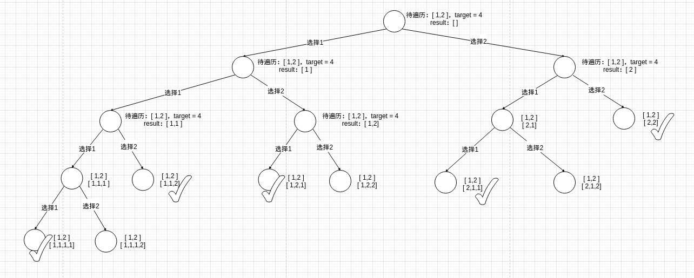
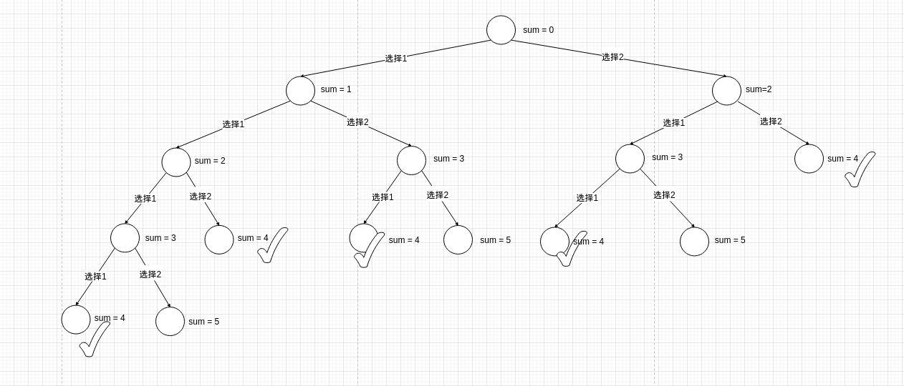

# 题目

给你一个由 **不同** 整数组成的数组 `nums` ，和一个目标整数 `target` 。请你从 `nums` 中找出并返回总和为 `target` 的元素组合的个数。

题目数据保证答案符合 32 位整数范围。

# 示例

```
输入：nums = [1,2,3], target = 4
输出：7
解释：
所有可能的组合为：
(1, 1, 1, 1)
(1, 1, 2)
(1, 2, 1)
(1, 3)
(2, 1, 1)
(2, 2)
(3, 1)
请注意，顺序不同的序列被视作不同的组合。
```

```
输入：nums = [9], target = 3
输出：0
```

# 思路

其实这道题用回溯硬解，也是可以的，毕竟它是组合总数的解法一样，只不过从求**组合解集**变成求**组合解集的个数**，并且顺序不同的解集**可以**被视作不同的解集。

但我之前说过，对于求解集的个数，可以考虑动态规划。而且用回溯硬解的话，这道题很容易超时。以[1,2]、target=4为例，画出决策树：



这么一看，好像不能使用动态规划。但是！！！仔细看题目：**顺序不同的序列被视作不同的组合**。而且题目并不想要解集，而是解集的个数，或许可以换个思路，将决策树的节点改成已选数字的和：



**这不就是纯纯的动态规划解决选择数的经典题-上楼梯问题吗？只不过楼梯最高阶级 = target，能选择的步数 = nums。**

有了上面的思路，尝试定义一下这道题的DP四要素

1. 选择：以哪个数字为最后一个数字
2. 选择带来的状态：算出两者的差
3. DP结果集：dp[i] = 在nums里dp[i]个解集，解集里面每个数的和都=i
4. 状态转移方程：
   1. nums = [x,y,z]
   2. dp[i] = dp[i-x] + dp[i-y] + dp[i-z]
   3. dp[0] = 1

# 代码

```go
package main

import "fmt"

func main() {
   fmt.Println(combinationSum4([]int{1, 2}, 3))
}

func combinationSum4(nums []int, target int) int {
   // dp[i] = 在nums里dp[i]个解集，解集里面每个数的和都=i
   dp := make(map[int]int, target+1)
   return stateTransition(nums, target, dp)
}

// 状态转移方程
func stateTransition(nums []int, i int, dp map[int]int) int {
   // dp出口： dp[0] = 1
   if i == 0 {
      return 1
   }

   result := 0

   for _, v := range nums {
      // 选择带来的影响：算出两者的差
      previous := i - v
      if previous < 0 {
         continue
      }
      // 记忆化剪枝
      previousValue, ok := dp[previous]
      if !ok {
         previousValue = stateTransition(nums, previous, dp)
      }
      // dp[i] = SUM(dp[i的previous])
      result = result + previousValue
   }
   dp[i] = result
   return result
}
```

