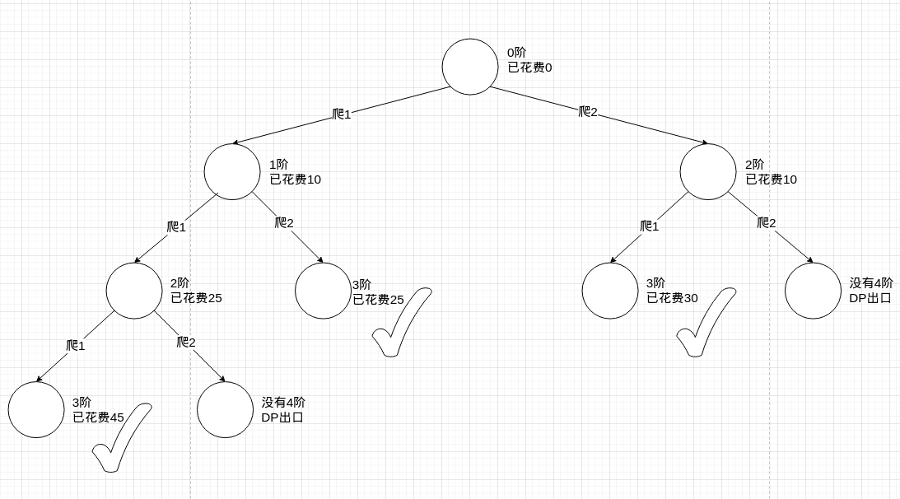

# 题目

给你一个整数数组 `cost` ，其中 `cost[i]` 是从楼梯第 `i` 个台阶向上爬需要支付的费用。一旦你支付此费用，即可选择向上爬一个或者两个台阶。

你可以选择从下标为 `0` 或下标为 `1` 的台阶开始爬楼梯。

请你计算并返回达到楼梯顶部的最低花费。

# 示例

```
输入：cost = [10,15,20]
输出：15
解释：你将从下标为 1 的台阶开始。
- 支付 15 ，向上爬两个台阶，到达楼梯顶部。
总花费为 15 。
```

```
输入：cost = [1,100,1,1,1,100,1,1,100,1]
输出：6
解释：你将从下标为 0 的台阶开始。
- 支付 1 ，向上爬两个台阶，到达下标为 2 的台阶。
- 支付 1 ，向上爬两个台阶，到达下标为 4 的台阶。
- 支付 1 ，向上爬两个台阶，到达下标为 6 的台阶。
- 支付 1 ，向上爬一个台阶，到达下标为 7 的台阶。
- 支付 1 ，向上爬两个台阶，到达下标为 9 的台阶。
- 支付 1 ，向上爬一个台阶，到达楼梯顶部。
总花费为 6 。
```

# 思路

和普通上楼梯的**动态规划求选择数**不同，这题的上楼梯是**动态规划求最优解**，也就是和[零钱兑换](https://github.com/9029HIME/Algorithm/tree/master/leetCode/20221007_322_Coin_Change)差不多的思路。根据[10,15,20]的示例画一下决策树：



这样看就明显了，存在重复枝叶min(2)和min(3)。

假设步数有x、y，最高阶数K。这道题的DP四要素：

1. 选择：选择走几步
2. 选择带来的状态：阶数发生变更
3. DP结果集：dp(i) = 从第i阶到楼梯顶部的最小花费
4. 状态转移方程：
   1. dp(i) = Min( dp(i+x), dp(i+y) )  + cost[i]
   2. dp[k] = 0

这个转移方程的核心是：当前阶 到 楼梯顶部的最小花费 = 当前阶花费 + 下一个选择阶数的最小花费。

# 代码

```go
package main

import (
	"fmt"
	"math"
)

func main() {
	fmt.Println(minCostClimbingStairs([]int{10, 15, 20}))
}

// 能选择的步数
var steps []int = []int{1, 2}

// 可以选择的起点
var origins []int = []int{0, 1}

func minCostClimbingStairs(cost []int) int {
	dp := make(map[int]int)
	minResult := math.MaxInt64
	for _, origin := range origins {
		result := stateTransition(cost, origin, dp)
		if result <= minResult {
			minResult = result
		}
	}
	return minResult
}

// 状态转移方程
func stateTransition(costs []int, i int, dp map[int]int) int {
	// dp出口，已经在最高阶了
	if i >= len(costs) {
		return 0
	}

	result := 0
	thisLevelValue := costs[i]
	minNextLevelValue := math.MaxInt64
	// 从某一阶开始，可以选择跨度
	for _, step := range steps {
		nextLevel := i + step
		nextLevelValue := 0

		// 记忆化剪枝
		v, ok := dp[nextLevel]
		if ok {
			nextLevelValue = v
		} else {
			nextLevelValue = stateTransition(costs, nextLevel, dp)
		}

		// 取最小值
		if nextLevelValue < minNextLevelValue {
			minNextLevelValue = nextLevelValue
		}
	}
	result = thisLevelValue + minNextLevelValue
	dp[i] = result
	return result
}
```