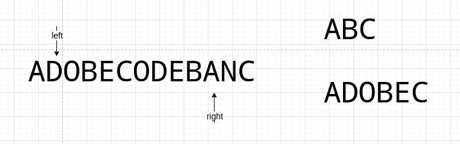

# 题目

给你一个字符串 `s` 、一个字符串 `t` 。返回 `s` 中涵盖 `t` 所有字符的最小子串。如果 `s` 中不存在涵盖 `t` 所有字符的子串，则返回空字符串 `""` 。

**注意：**

- 对于 `t` 中重复字符，我们寻找的子字符串中该字符数量必须不少于 `t` 中该字符数量。
- 如果 `s` 中存在这样的子串，我们保证它是唯一的答案。

# 示例

```
输入：s = "ADOBECODEBANC", t = "ABC"
输出："BANC"
```

```
输入：s = "a", t = "a"
输出："a"
```

```
输入: s = "a", t = "aa"
输出: ""
解释: t 中两个字符 'a' 均应包含在 s 的子串中，
因此没有符合条件的子字符串，返回空字符串。
```

# 思路

还是那句话：看到子串结果，优先考虑滑动窗口。这是一道很经典的滑动窗口题。

那该怎么滑呢？以s=ADOBECODEBANC，t=ABC为例，由left和right指针组成一个滑动窗口：


初始状态，left和right均指向s的第一个字符。


right不停向右滑，直到C找到符合条件的子串ADOBEC，但它不一定是最小子串，所以先保存起来。


left不停向右滑，直到破坏符合条件的子串，此时left指向D。



轮到right滑动，直到找到符合条件的子串DOBECODEBA，但它不是最小子串，所以无视。


轮到left滑动，直到破坏符合条件的子串，此时left指向O，取[left-1,right]作为符合条件的子串，即CODBEA，因为它和ADOBEC一样长，所以无视。

轮到right滑动，直到找到符合条件的子串ODEBANC，但它不是最小子串，所以无视。


轮到left滑动，直到破坏符合条件的子串，此时left指向A，取[left-1,right]作为符合条件的子串，即BANC，因为它小于ADOBEC，所以将结果更新为它。

轮到right滑动...滑不了了，因为right已经到达字符串的尾部，滑动结束，取结果BANC为题目的答案。

**这道题目的滑动四要素是：**

1. **窗口：**

   **k:v = 字符:出现次数**

2. **移动right后的更新窗口逻辑：**

   **判断right字符是否属于t，如果是，放进窗口。判断right字符的出现次数 是否 满足t的要求，如果是，valid++。**

3. **left滑动条件：**

   **在s已经找到t的覆盖子串，但不一定是最大。**

4. **移动left后的更新窗口逻辑：**

   **判断left字符是否属于t，如果是，减少left次数在窗口的次数，并减少valid值，从而不命中下次left移动。**

# 代码

使用滑动窗口的经典代码进行改动：

```go
func Slide(s string) string {
   window := ""
   result := ""
   length := len(s)
   left := 0
   right := 0
   for right < length && left < length {
      // 初始状态的窗口
      window = s[left : right+1]
      fmt.Println(fmt.Sprintf("\nstr:%v\nwindow:%v", s, window))
      // 开始右边滑动
      right++

      // 左边窗口开始滑（需要命中条件）
      for LeftNeedShrink() {
         left++
         // 执行移动左指针后的数据更新
         window = window[left : right+1]
         fmt.Println(fmt.Sprintf("\nstr:%v\nwindow:%v", s, window))
      }
   }
   return result
}

func LeftNeedShrink() bool {
   return false
}
```

符合其题意即可：

```go
func main() {
	fmt.Println(minWindow("ADOBECODEBANC", "ABC"))
	fmt.Println(minWindow("aa", "aa"))
	fmt.Println(minWindow("aaaaaaaaaaaabbbbbcdd", "abcdd"))
}

func minWindow(s string, t string) string {
	window := make(map[rune]int)
	tMap := make(map[rune]int)

	for _, v := range t {
		existV, ok := tMap[v]
		if ok {
			tMap[v] = existV + 1
		} else {
			tMap[v] = 1
		}
		window[v] = 0
	}

	result := slide(window, tMap, s)
	return result
}

func slide(window map[rune]int, tMap map[rune]int, s string) string {
	result := ""
	length := len(s)
	left := 0
	right := 0
	valid := 0
	for right < length && left < length {
		// 获取right资源
		rC := rune(s[right])

		right++

		// 更新窗口
		if needCount, ok := tMap[rC]; ok {
			// 如果是t包含的字符的话
			window[rC] = window[rC] + 1
			// 如果这个字符已经达标了
			if window[rC] == needCount {
				valid++
			}
		}

		for leftNeedShrink(valid, len(tMap)) {
			// 走到这，意味着left和right已经找到了覆盖子串（不一定最小），所以先和result比较。
			s2 := s[left:right]
			if result == "" {
				result = s2
			} else if len(result) >= len(s2) {
				result = s2
			}

			// 获取left资源
			lC := rune(s[left])

			left++

			// 更新窗口
			if existCount, ok := window[lC]; ok && existCount > 0 {
				existCount = existCount - 1
				window[lC] = existCount
				// 如果该字符的存在个数 ＜ 要求个数，valid要减少，不命中下次的左滑
				if existCount < tMap[lC] {
					valid--
				}
			}
		}
	}
	return result
}

func leftNeedShrink(valid int, tMapLen int) bool {
	// 有效字符数 = t的要求字符数量，即 已经找到t的覆盖子串了
	return valid == tMapLen
}
```