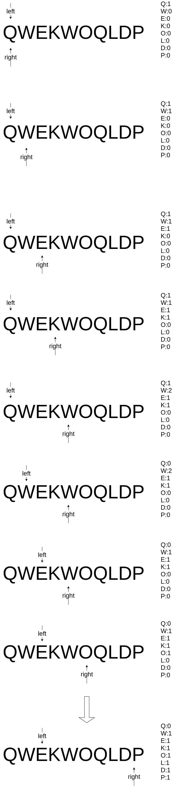

# 题目

给定一个字符串 `s` ，请你找出其中不含有重复字符的 **最长子串** 的长度。

# 示例

```
输入: s = "abcabcbb"
输出: 3 
解释: 因为无重复字符的最长子串是 "abc"，所以其长度为 3。
```

```
输入: s = "bbbbb"
输出: 1
解释: 因为无重复字符的最长子串是 "b"，所以其长度为 1。
```

```
输入: s = "pwwkew"
输出: 3
解释: 因为无重复字符的最长子串是 "wke"，所以其长度为 3。
     请注意，你的答案必须是 子串 的长度，"pwke" 是一个子序列，不是子串。
```

# 思路

基于前面的滑动窗口练习，[比起第一次写这道题](https://github.com/9029HIME/Algorithm/tree/master/leetCode/20220909_Longest_Substring_Without_Repeating_Characters)，发现一个更丝滑的滑动方法：基于统计每个字符的出现字数，**而不是下标**。如图所示：

图

# 代码

```go
func main() {
   fmt.Println(lengthOfLongestSubstring("pwwkew"))
   fmt.Println(lengthOfLongestSubstring("abcabcbb"))
   fmt.Println(lengthOfLongestSubstring("bbbbb"))
}

func lengthOfLongestSubstring(s string) int {
   return Slide(s)
}

func Slide(s string) int {
   result := 0
   length := len(s)
   if length == 0 {
      return 0
   }
   // k:v = char : frequency
   window := make(map[string]int)
   left := 0
   right := 0
   for left < length && right < length {
      // 获取right资源
      rightC := string(s[right])

      right++

      // 更新窗口
      window[rightC] = window[rightC] + 1

      // 是否需要移动left
      for LeftNeedShrink(rightC, window) {
         // 获取left资源
         leftC := string(s[left])

         left++

         // 更新窗口
         window[leftC] = window[leftC] - 1
      }
      tmpResult := right - left
      if result < tmpResult {
         result = tmpResult
      }
   }

   return result
}

func LeftNeedShrink(rightC string, window map[string]int) bool {
   // 右指针移动后，发现了重复字符
   return window[rightC] > 1
}
```