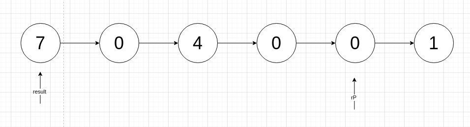

# 题目

给你两个 **非空** 的链表，表示两个非负的整数。它们每位数字都是按照 **逆序** 的方式存储的，并且每个节点只能存储 **一位** 数字。

请你将两个数相加，并以相同形式返回一个表示和的链表。

你可以假设除了数字 0 之外，这两个数都不会以 0 开头。

# 示例

```
输入：l1 = [2,4,3], l2 = [5,6,4]
输出：[7,0,8]
解释：342 + 465 = 807.
```

```
输入：l1 = [0], l2 = [0]
输出：[0]
```

```
输入：l1 = [9,9,9,9,9,9,9], l2 = [9,9,9,9]
输出：[8,9,9,9,0,0,0,1]
```

# 思路

一开始看着道题有点打脑壳，其实很容易理解，1个链表代表1个数字，这个数字的个、十、百、千位分别对应 按链表顺序遍历的值。

比如 2 → 4 → 3，代表342这个数，个位数是2，十位数是4，百位数是2。

而我要做的是将2个链表代表的数字进行加法处理，并且结果也要用1个链表存放，也是按照 个 → 十 → 百的顺序。

那这样就挺好做了，毕竟加法也是根据个十百千的顺序进行累加，这道题估计是考察下一位+1的处理。以 2 → 4 → 9 和 5 → 6 → 4 → 9 → 9为例：


对于这种遍历n个链表，形成1个最终链表的题目，我一般会用n+1个指针辅助遍历。2 + 5 = 7。7 - 10 是＜0的，不满足下一位+1的条件。所以rP赋值7。


下一位，6 + 4 = 10，10 - 10 = 0 >= 0，下一位+1，并且rp的next要赋值0。


下一位，9 + 4 = 13，因为上一位≥10，所以13要+1=14，14 - 10 = 4 ≥ 0，下一位+1，并且rp的next要赋值4。


此时链表a已经遍历完了，和[合并K个有序链表](https://github.com/9029HIME/Algorithm/tree/master/leetCode/20221022_HARD_23_Merge_K_Sorted_Lists---Singly-Linked-List)一样，将最后剩下的链表直接追加到rP后面。




以为这样就完了吗？这是我踩得第一个坑，4的下一位是需要+1的，同理下下位也是要判断是否+1。直到rP到达终点。此时直接返回result就好了。


# 代码

```go
package main

func main() {

}

type ListNode struct {
	Val  int
	Next *ListNode
}

func addTwoNumbers(l1 *ListNode, l2 *ListNode) *ListNode {
	addOne := false
	var result *ListNode
	var rPointer *ListNode
	aPointer := l1
	bPointer := l2
	for aPointer != nil && bPointer != nil {
		a := aPointer.Val
		b := bPointer.Val
		c := a + b

		if addOne {
			c++
			addOne = false
		}
		d := c - 10
		if d >= 0 {
			addOne = true
			c = d
		}
		if result == nil {
			result = new(ListNode)
			result.Val = c
			rPointer = result
		} else {
			next := new(ListNode)
			next.Val = c
			rPointer.Next = next
			rPointer = rPointer.Next
		}

		aPointer = aPointer.Next
		bPointer = bPointer.Next
	}

	// 其中一个链表遍历完，将另一个链表直接追加到result
	if aPointer == nil {
		rPointer.Next = bPointer
	}
	if bPointer == nil {
		rPointer.Next = aPointer
	}

	// 梳理另一个链表的值，是否需要进1
	for rPointer.Next != nil {
		e := rPointer.Next.Val
		if addOne {
			e++
			addOne = false
		}
		f := e - 10
		if f >= 0 {
			addOne = true
			e = f
		}
		rPointer.Next.Val = e
		rPointer = rPointer.Next
	}

	// 如果仍需要进1，则补充一个新节点，值为1
	if addOne {
		rPointer.Next = &ListNode{
			Val: 1,
		}
	}

	return result
}
```


