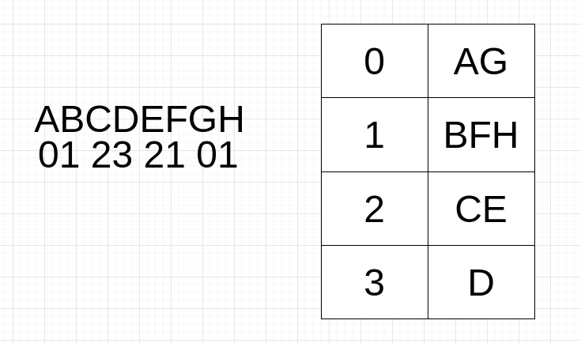

# 题目

将一个给定字符串 `s` 根据给定的行数 `numRows` ，以从上往下、从左到右进行 Z 字形排列。

比如输入字符串为 `"PAYPALISHIRING"` 行数为 `3` 时，排列如下：

```
P   A   H   N
A P L S I I G
Y   I   R
```

之后，你的输出需要从左往右逐行读取，产生出一个新的字符串，比如：`"PAHNAPLSIIGYIR"`。

请你实现这个将字符串进行指定行数变换的函数：

```
string convert(string s, int numRows);
```

# 示例

```
输入：s = "PAYPALISHIRING", numRows = 3
输出："PAHNAPLSIIGYIR"
```

```
输入：s = "PAYPALISHIRING", numRows = 4
输出："PINALSIGYAHRPI"
解释：
P     I    N
A   L S  I G
Y A   H R
P     I
```

```
输入：s = "A", numRows = 1
输出："A"
```

# 思路

其实没那么玄乎，给s的每一个字符标记一个整数就好了。加入numRows = 4，那么s的整数就是12343212343212343...

通过整数确定一个数组下标，假设numRows = 4，那么数组的长度应该为3。



循环s的第1个字符c1，将c1追加放进arr[0]。

循环s的第2个字符c2，将c2追加放进arr[1]。

循环s的第3个字符c3，将c3追加放进arr[2]。

循环s的第4个字符c4，将c4追加放进arr[3]。

循环s的第5个字符c5，将c5追加放进arr[2]。

循环s的第6个字符c6，将c6追加放进arr[1]。

这道题的核心难点在于：如何控制从0-3，再从3-0，再从0-3？有一个比较巧妙的做法：引入step的概念，具体怎么用看代码。

# 代码

注意numRows＜2的临界状态，直接返回即可。

```go
package main

import "fmt"

func main() {
   fmt.Println(convert("AB", 1))
}

func convert(s string, numRows int) string {
   rows := make([]string, numRows)
   if numRows < 2 {
      return s
   }
   row := 0
   step := -1
   for _, c := range s {
      rows[row] = rows[row] + string(c)
      if row == 0 || row == numRows-1 {
         step = -step
      }
      row = row + step
   }
   result := ""
   for _, s := range rows {
      result = result + s
   }
   return result
}
```