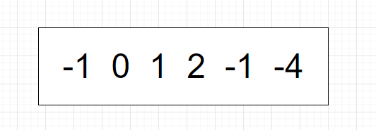

# 题目

给你一个整数数组 `nums` ，判断是否存在三元组 `[nums[i], nums[j], nums[k]]` 满足 `i != j`、`i != k` 且 `j != k` ，同时还满足 `nums[i] + nums[j] + nums[k] == 0` 。请

你返回所有和为 `0` 且不重复的三元组。

**注意：**答案中不可以包含重复的三元组。

# 示例

```
输入：nums = [-1,0,1,2,-1,-4]
输出：[[-1,-1,2],[-1,0,1]]
解释：
nums[0] + nums[1] + nums[2] = (-1) + 0 + 1 = 0 。
nums[1] + nums[2] + nums[4] = 0 + 1 + (-1) = 0 。
nums[0] + nums[3] + nums[4] = (-1) + 2 + (-1) = 0 。
不同的三元组是 [-1,0,1] 和 [-1,-1,2] 。
注意，输出的顺序和三元组的顺序并不重要。
```

```
输入：nums = [0,1,1]
输出：[]
解释：唯一可能的三元组和不为 0 。
```

```
输入：nums = [0,0,0]
输出：[[0,0,0]]
解释：唯一可能的三元组和为 0 。
```

# 思路

这道题很经典，和[两数之和2](https://github.com/9029HIME/Algorithm/tree/master/leetCode/20221102_MIDEUM_167_Two_Sum-II-Input_Array_Is_Sorted---Array)有点类似，都是围绕偏大偏小来移动指针。

因为nums是乱序的，想要找到3数，必须先进行事前排序。以-1,0,1,2,-1,-4为例：




通过i、j、k三个指针代表3数，j默认比i大1，k默认为数组末尾。此时发现三数之和=-3，比期望值0偏小，于是需要挪动j指针。


因为此时j仍是-1，j仍要继续挪动。


此时三数之和=-2，还是偏小，继续挪动j。


此时三数之和=-1，还是偏小，继续挪动j，发现j和k重叠了，于是i=-4的情况遍历完毕，没有找到解。


于是挪动i，并且重置j和k的位置，此时三数之和刚好为0，作为一个结果添加到结果集内。**为了避免重复解，需要同时挪动j和k。**


同样的，下一次三数之和也为0，作为一个结果添加到结果集内，同时挪动j和k，此时j和k重合了。需要重新挪动i，重置j和k的位置。


直到i遍历完毕。

## 要注意的case

大体思路就是这样，先排序，初始化3个指针，然后根据三数之和的情况，挪动3个指针。但是题目要求去除重复解，这道题有3种重复解的情况：

1. i重复

   遍历下一个i的时候，有可能i值和上一个i值相同，此时可以直接跳过。

2. j重复

   j重复分为两种情况：

   1. 上一次j得到期望结果，此时需要继续挪动j，避免重复结果的产生。
   2. 上一次j没有得到期望结果，此时没必要挪动j，因为和上一个j相同，这次仍不会得到期望结果，就没有“重复结果”的说法。

3. k重复

   和j重复一样，也是分为两种情况，只有上一次k得到了期望结果，此时k才要继续挪动。

可能过段时间我会看不懂这段case，我觉得有必要画个图举例：


以这个case为例，此时nums[i] + nums[j] + nums[k] = 0，j和k需要挪动位置，j++，k--。


此时会得到上一次重复的j和k，如果不做任何处理，会认为nums[i] + nums[j] + nums[k] = 0，添加重复结果。所以需要继续挪动j和k。


直到j和上次挪动的j不一致，k和上次挪动的k也不一致。

# 代码

```go
package main

import (
   "fmt"
   "sort"
)

func main() {
   //fmt.Println(threeSum([]int{-1, 0, 1, 2, -1, -4}))
   fmt.Println(threeSum([]int{-2, 0, 0, 2, 2}))
}

func threeSum(nums []int) [][]int {
   sort.Ints(nums)
   result := make([][]int, 0, 2)
   tail := len(nums) - 1
   for i, num := range nums {
      if num > 0 {
         return result
      }
      if i > 0 && nums[i] == nums[i-1] {
         continue
      }
      j := i + 1
      k := tail
      for j < k {
         sum := num + nums[j] + nums[k]
         if sum > 0 {
            // 偏大了，让最大值减少一点
            k--
         } else if sum < 0 {
            // 偏小了，让最小值加大一点
            j++
         } else {
            // 能走到这，说明 sum == 0，添加结果
            r := []int{num, nums[j], nums[k]}
            result = append(result, r)
            // 找到解后，缩小j和k的范围，寻找同等i的下一个解
            for j < k && nums[j+1] == nums[j] {
               // 避免重复解，对重复j进行跳过
               j++
            }
            for j < k && nums[k-1] == nums[k] {
               // 避免重复解，对重复k进行跳过
               k--
            }
            // 能走到这，说明下一个j和k都不是重复的，可以自增
            j++
            k--
         }
      }
   }
   return result
}
```