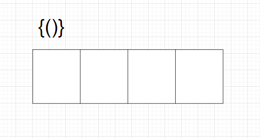

# 题目

给定一个只包括 `'('`，`')'`，`'{'`，`'}'`，`'['`，`']'` 的字符串 `s` ，判断字符串是否有效。

有效字符串需满足：

1. 左括号必须用相同类型的右括号闭合。
2. 左括号必须以正确的顺序闭合。
3. 每个右括号都有一个对应的相同类型的左括号。

# 示例

```
输入：s = "()"
输出：true
```

```
输入：s = "()[]{}"
输出：true
```

```
输入：s = "(]"
输出：false
```

# 思路

比较有意思的题目，需要用压栈和出栈解决。还是有必要画个图的，以“{()}”为例：




以“{{)}”为例：


要注意两个case：

1. 全是左括号 || 右括号不足

   因为全是左括号，所以循环过程中不会有pop操作，循环结束后栈内数据全是左括号。或者右括号不足，最终栈内会剩余左括号。

   循环结束后，可以通过isEmpty来判断返回结果。不为空=false，为空=true。

2. 以右括号开头

   此时栈内没有数据，直接pop会导致下标-1越界。最好在pop阶段判断下标，如果是-1直接返回一个魔法值，在循环代码判断魔法值并返回false。

# 代码

话说Golang好像没有自带的Stack，所以手动实现一个。

```go
package main

import "fmt"

func main() {
   fmt.Println(isValid("()"))
   fmt.Println(isValid("()[]{}"))
   fmt.Println(isValid("(]"))
   fmt.Println(isValid("(("))
   fmt.Println(isValid("){"))
}

func isValid(s string) bool {
   length := len(s)
   if length%2 != 0 {
      return false
   }
   stack := InitStack()
   for _, v := range s {
      p := string(v)
      // 左括号，直接压栈
      if p == "{" || p == "(" || p == "[" {
         stack.push(p)
         continue
      }
      // 像}(这种结构，一开始就给右括号，默认pop返回error，否则-1下标会抛异常。
      pop := stack.pop()
      if pop == "error" {
         return false
      }

      // 比较右括号 和 左括号是否匹配，有一个不匹配就返回false
      switch p {
         case "}":
            if pop != "{" {
               return false
            }
         case ")":
            if pop != "(" {
               return false
            }
         case "]":
            if pop != "[" {
               return false
            }
         default:
            return false
      }
   }
   // 有可能s全部由左括号构成，此时stack的数据长度不为空，返回false
   if stack.isEmpty() {
      return true
   } else {
      return false
   }
}

type Stack struct {
   data []string
}

func InitStack() *Stack {
   return &Stack{
      data: make([]string, 0, 8),
   }
}

func (this *Stack) pop() string {
   index := len(this.data) - 1
   if index == -1 {
      return "error"
   }
   pop := this.data[index]
   this.data = this.data[0:index]
   return pop
}

func (this *Stack) push(str string) {
   this.data = append(this.data, str)
}

func (this *Stack) isEmpty() bool {
   return len(this.data) == 0
}
```