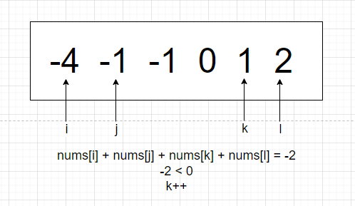

# 题目

给你一个由 `n` 个整数组成的数组 `nums` ，和一个目标值 `target` 。请你找出并返回满足下述全部条件且**不重复**的四元组 `[nums[a], nums[b], nums[c], nums[d]]` （若两个四元组元素一一对应，则认为两个四元组重复）：

- `0 <= a, b, c, d < n`
- `a`、`b`、`c` 和 `d` **互不相同**
- `nums[a] + nums[b] + nums[c] + nums[d] == target`

你可以按 **任意顺序** 返回答案 。

# 示例

```
输入：nums = [1,0,-1,0,-2,2], target = 0
输出：[[-2,-1,1,2],[-2,0,0,2],[-1,0,0,1]]
```

```
输入：nums = [2,2,2,2,2], target = 8
输出：[[2,2,2,2]]
```

# 思路

其实本题是三数之和的扩展，除了3变成4、0变成target以外，没有任何区别。如果掌握了这道题的核心，相当于掌握了“K数之和”。

和三数之和一样，本题也是需要挪动左右指针，并且考虑**去重**。区别是三数之和需要i、j、k三个指针，挪动j和k。而本题需要i、j、k、l四个指针，挪动k和l，本题的k和l相当于三数之和的j和k，那么i和j该如何挪动呢？为了方便举例，还是以三数之和为例子，target = 0：


初始状态下，i=0，j = i+1，k = j+1，l = 末尾，一开始4个指针的和 = -4，-4小于0，说明和偏小，于是挪动k。


同样的，挪动k后发现仍不满足，还要继续挪。



仍不满足，继续挪。但是，再挪下去k和l就重合了。


于是挪动j，重置k和l的位置，此时发现j和上一次j重复，需要继续挪j，重置k（去重）。


四数之和 = -1，偏小，需要挪k，但是再挪下去k和l就重合了，于是挪动j。


但是再挪下去，j、k、l就重合了（j必须小于len(nums) - 2)，于是需要挪动i，重置j、k、l的位置。此时四数之和 = 0，添加到结果集里。到后面就是同样的流程了。

## 核心思路

三数之和是先挪动j、k，直到j和k重合，**才挪动i，并且重置j和k的位置**。

而四数之和也是先挪动k、l，当k和l重合后，**优先挪动j，并且重置k和l的位置**。直到j和k、l重合，**才开始挪动i，并且重置j、k、l的位置**。

对于四数的k、l的去重，和三数的j、k是一致的，都是找到正确解后才去重。

对于四数的j，比较特殊，只有在初始位置之后（j = i + 1）的挪动，才要判断去重。这点和i的去重一样，也是在初始位置之后（i = 0）才判断。

## K数之和

同理，哪怕是五数之和，也是围绕i、j、k、l、p这5个指针进行，l和p是逐渐靠拢的指针，当l和p重合后，再挪动k，当k和l、p重合后，再挪动j，当j和k、l、p重合后，再挪动i。同理可以扩展到六数、七数、K数...

对于**除了最后两个**的指针，都要在初始位置之后的挪动判断去重。以五数之和来说，i的初始位置是0，j的初始位置是i + 1（每次i的循环都不一样），k的初始位置是j + 1（每次k的循环都不一样）

通过这样的解法，可以将k数之和的时间复杂度降低为O(n的k-1次方)。

