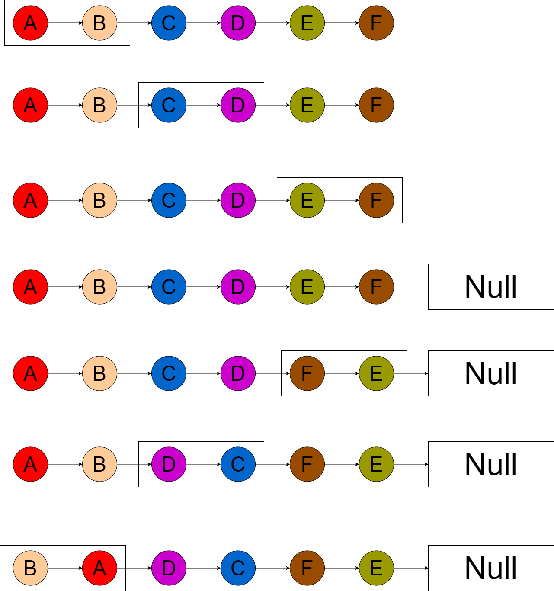

# 题目

给你一个链表，两两交换其中相邻的节点，并返回交换后链表的头节点。你必须在不修改节点内部的值的情况下完成本题（即，只能进行节点交换）。

# 示例

```
输入：head = [1,2,3,4]
输出：[2,1,4,3]
```

```
输入：head = []
输出：[]
```

```
输入：head = [1]
输出：[1]
```

# 思路

比较经典的递归题，直接画图就能表示思路，方框可以理解为 翻转函数 的栈帧：



# 代码

```go
package main

import "fmt"

func main() {
   head := BuildSinglyLinedList([]int{})
   newHead := swapPairs(head)
   fmt.Println(newHead)
}

type ListNode struct {
   Val  int
   Next *ListNode
}

func swapPairs(head *ListNode) *ListNode {
   return Swap(head)
}

/**
A → B
head = A
after swap: B → A
return B
*/
func Swap(head *ListNode) *ListNode {
   /*
      A → B
      previousHead = A
      previousNext = B
      previousNextHead = nil
      有可能本次方法的传参是nil，直接返回就好
   */
   if head == nil {
      return head
   }
   /*
      A → B → C
      previousHead = A
      previousNext = B
      previousNextHead = C
      有可能本次方法的传参C可能next为nil，直接返回C本身就好
   */
   next := head.Next
   if next == nil {
      return head
   }
   nextHead := next.Next
   /*
      A → B → C → D
      head = A
      next = B
      nextHead = C
      swap(C)
      after swap(C): A → B → D → C, return D
      after swap(A): B → A → D → C, return B
      所以要将A的next指向D，B的next指向A，本次swap(A) return B
   */
   head.Next = Swap(nextHead)
   next.Next = head
   return next
}

/**
通过切片初始化链表
*/
func BuildSinglyLinedList(nums []int) *ListNode {
   var head *ListNode
   var pointer *ListNode
   for _, num := range nums {
      if head == nil {
         head = new(ListNode)
         head.Val = num
         pointer = head
      } else {
         next := new(ListNode)
         next.Val = num
         pointer.Next = next
         pointer = pointer.Next
      }
   }
   return head
}
```