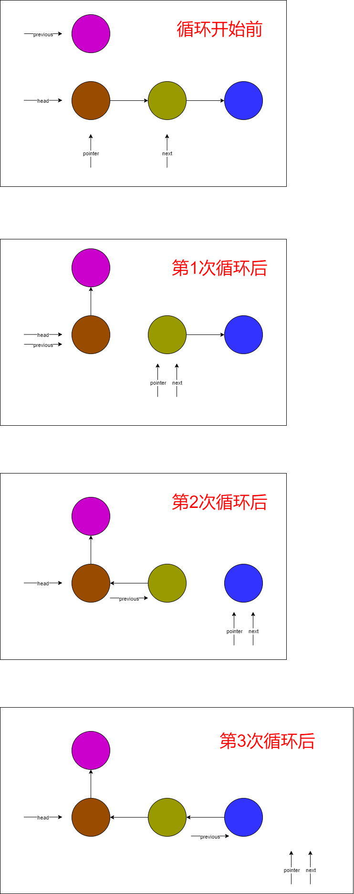

# 题目

给你链表的头节点 `head` ，每 `k` 个节点一组进行翻转，请你返回修改后的链表。

`k` 是一个正整数，它的值小于或等于链表的长度。如果节点总数不是 `k` 的整数倍，那么请将最后剩余的节点保持原有顺序。

你不能只是单纯的改变节点内部的值，而是需要实际进行节点交换。

# 示例

```
输入：head = [1,2,3,4,5], k = 3
输出：[3,2,1,4,5]
```

# 思路

和两两交换链表中的节点（链接TODO）没什么区别，只是2变成了k。主要有2个case需要考虑：

1. Swap函数里，先要判断head后面（包含head）是否一共有k个节点，如果不是，直接返回head（如果节点总数不是 `k` 的整数倍，那么请将最后剩余的节点保持原有顺序）

2. 如果1.条件成立，需要对Swap函数 从head开始往后k个节点 进行翻转，将head的next指向 上一次Swap函数返回值，然后将 最后一个节点 返回给上层。这一步比较复杂，画个流程图展示：

   

   其中 previous初始值 是上一次Swap函数返回值，本次Swap函数要返回 循环结束后的previous。

# 代码

```go
package main

import "fmt"

func main() {
   head := BuildSinglyLinedList([]int{1, 2, 3, 4, 5})
   newHead := reverseKGroup(head, 2)
   fmt.Println(newHead)
}

type ListNode struct {
   Val  int
   Next *ListNode
}

func reverseKGroup(head *ListNode, k int) *ListNode {
   return Swap(head, k)
}

/**
A → B → C , k=3
head = A
after swap: C → B → A
return C

A → B , k=3
head = A
after swap: A → B
return A
*/
func Swap(head *ListNode, k int) *ListNode {
   pointer := head
   /*
      校验包括自己，后面一共有K个节点，如果不是，直接返回head，保证K个一组
      A → B → C → D
      ↑
      A → B → C → D
          ↑
      A → B → C → D
              ↑
   */
   for i := 0; i < k; i++ {
      if pointer == nil {
         return head
      }
      pointer = pointer.Next
   }
   /*
      A → B → C → D → E → F
               	  ↑
   */
   nextHead := pointer
   /*
      A → B → C → F → E → D
               	  ↑
   */
   nextHead = Swap(nextHead, k)

   /*
      下面的流程跟drawio图一致
   */
   pointer = head
   previous := nextHead
   for i := 0; i < k; i++ {
      next := pointer.Next
      pointer.Next = previous
      previous = pointer
      pointer = next
   }
   return previous
}

/**
通过切片初始化链表
*/
func BuildSinglyLinedList(nums []int) *ListNode {
   var head *ListNode
   var pointer *ListNode
   for _, num := range nums {
      if head == nil {
         head = new(ListNode)
         head.Val = num
         pointer = head
      } else {
         next := new(ListNode)
         next.Val = num
         pointer.Next = next
         pointer = pointer.Next
      }
   }
   return head
}
```