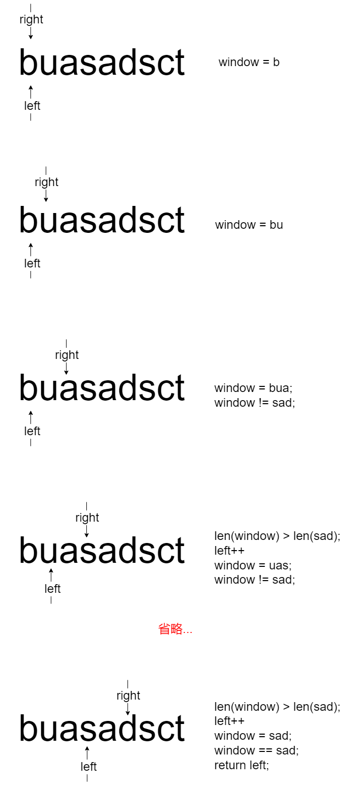

# 题目

给你两个字符串 `haystack` 和 `needle` ，请你在 `haystack` 字符串中找出 `needle` 字符串的第一个匹配项的下标（下标从 0 开始）。如果 `needle` 不是 `haystack` 的一部分，则返回 `-1` 。

# 示例

```
输入：haystack = "sadbutsad", needle = "sad"
输出：0
解释："sad" 在下标 0 和 6 处匹配。
第一个匹配项的下标是 0 ，所以返回 0 。
```

```
输入：haystack = "leetcode", needle = "leeto"
输出：-1
解释："leeto" 没有在 "leetcode" 中出现，所以返回 -1 。
```

# 思路

对于这种字符串匹配问题，优先考虑滑动窗口。

具体怎么滑？以haystack = "buasadsct", needle = "sad"为例：



# 代码

```go
package main

import "fmt"

func main() {
	fmt.Println(strStr("buasadsct", "sad"))
}

func strStr(haystack string, needle string) int {
	return Slide(haystack, needle)
}

func Slide(haystack string, needle string) int {
	left := 0
	right := 0
	length := len(haystack)
	needleLen := len(needle)
	window := ""
	for left < length && right < length {
		// right资源
		rightC := string(haystack[right])
		// 增加right
		right++
		// 更新窗口
		window = window + rightC

		for LeftNeedShrink(left, right, needleLen) {
			// 比较window 和 needle
			if window == needle {
				return left
			}
			// 不需要获取left资源，直接++
			left++
			// 更新窗口
			window = window[1:]
		}

	}
	return -1
}

func LeftNeedShrink(left int, right int, needleLen int) bool {
	return right-left+1 > needleLen
}

```