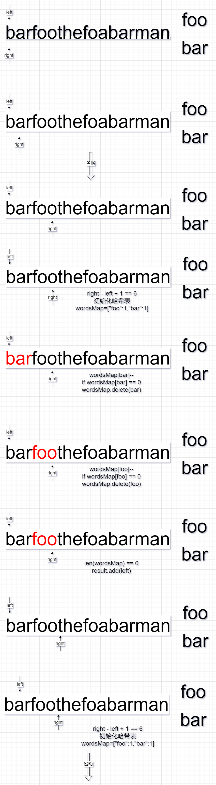

# 题目

给定一个字符串 `s` 和一个字符串数组 `words`**。** `words` 中所有字符串 **长度相同**。

 `s` 中的 **串联子串** 是指一个包含 `words` 中所有字符串以任意顺序排列连接起来的子串。

- 例如，如果 `words = ["ab","cd","ef"]`， 那么 `"abcdef"`， `"abefcd"`，`"cdabef"`， `"cdefab"`，`"efabcd"`， 和 `"efcdab"` 都是串联子串。 `"acdbef"` 不是串联子串，因为他不是任何 `words` 排列的连接。

返回所有串联字串在 `s` 中的开始索引。你可以以 **任意顺序** 返回答案。

# 示例

```
输入：s = "barfoothefoobarman", words = ["foo","bar"]
输出：[0,9]
解释：因为 words.length == 2 同时 words[i].length == 3，连接的子字符串的长度必须为 6。
子串 "barfoo" 开始位置是 0。它是 words 中以 ["bar","foo"] 顺序排列的连接。
子串 "foobar" 开始位置是 9。它是 words 中以 ["foo","bar"] 顺序排列的连接。
输出顺序无关紧要。返回 [9,0] 也是可以的。
```

```
输入：s = "wordgoodgoodgoodbestword", words = ["word","good","best","word"]
输出：[]
解释：因为 words.length == 4 并且 words[i].length == 4，所以串联子串的长度必须为 16。
s 中没有子串长度为 16 并且等于 words 的任何顺序排列的连接。
所以我们返回一个空数组。
```

```
输入：s = "barfoofoobarthefoobarman", words = ["bar","foo","the"]
输出：[6,9,12]
解释：因为 words.length == 3 并且 words[i].length == 3，所以串联子串的长度必须为 9。
子串 "foobarthe" 开始位置是 6。它是 words 中以 ["foo","bar","the"] 顺序排列的连接。
子串 "barthefoo" 开始位置是 9。它是 words 中以 ["bar","the","foo"] 顺序排列的连接。
子串 "thefoobar" 开始位置是 12。它是 words 中以 ["the","foo","bar"] 顺序排列的连接。
```

# 思路

找子串，选滑动。但是这道题需要比对words的所有排序，有什么方式能在滑动的时候，快速判断不是排序之一呢？而且words的字符串之间会有重复字符。好像没有一个通用的做法，猜测时间复杂度是O(N x M)，N是s长度，M是words的字符串个数。

该怎么滑，模拟了一下，s = "barfoothefoabarman", words = ["foo","bar"]为例，得出了这张图：



按照题目要求，这道题是固定大小窗口，当窗口到达最大值后，需要对窗口内的字符串window进行比较。

怎么比较？题目说word的长度是相等的，所以直接暴力截取window的定长子串得到pieceOfWindow，通过pieceOfWindow进行比较。

对于比较这一块，比较好的优化思路是通过hash表进行，每次确定window后，初始化wordsMap，key存放word，value存放word的出现次数，比对成功则-1，为0则delete。

最终通过hash表长度 == 0来确定窗口是 words的串联子串。

当然，还有一个优化点，如果pieceOfWindow的在wordsMap找不到数据，说明window不是串联子串，可以直接返回，避免后面无意义的比较。

# 代码

```go
package main

import "fmt"

func main() {
   fmt.Println(findSubstring("barfoofoothebar", []string{"foo", "bar", "the"}))
}

func findSubstring(s string, words []string) []int {
   return Slide(s, words)
}

func Slide(s string, words []string) []int {
   result := make([]int, 0, 1)
   length := len(s)
   size := len(words)
   wordSize := len(words[0])
   window := ""
   windowMaxSize := size * wordSize
   left := 0
   right := 0

   for left < length && right < length {
      rightC := string(s[right])
      right++
      // 更新窗口
      window = window + rightC
      if len(window) == windowMaxSize {
         wordsMap := make(map[string]int)
         for _, str := range words {
            wordsMap[str] = wordsMap[str] + 1
         }
         // 按照wordSize分割window，判断是否命中wordsMap
         for j := 0; j <= windowMaxSize-wordSize; j = j + wordSize {
            pieceOfWindow := window[j : j+wordSize]
            count, ok := wordsMap[pieceOfWindow]
            if ok && count > 0 {
               newValue := wordsMap[pieceOfWindow] - 1
               if newValue == 0 {
                  // 已经匹配完了
                  delete(wordsMap, pieceOfWindow)
               } else {
                  wordsMap[pieceOfWindow] = newValue
               }
            } else {
               // 优化点1：没必要再比对了
               break
            }
         }
         // 如果wordsMap的size == 0，说明window命中所有word
         if len(wordsMap) == 0 {
            result = append(result, left)
         }

      }

      for LeftNeedShrink(left, right, windowMaxSize) {
         left++
         // 更新窗口
         window = window[1:]
      }
   }

   return result
}

func LeftNeedShrink(left int, right int, size int) bool {
   return right-left >= size
}
```