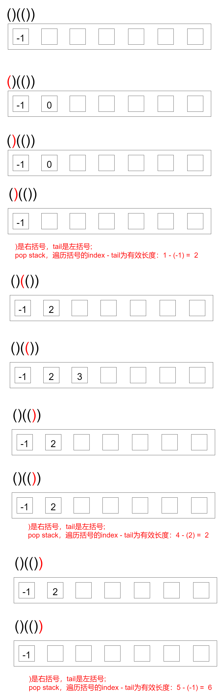
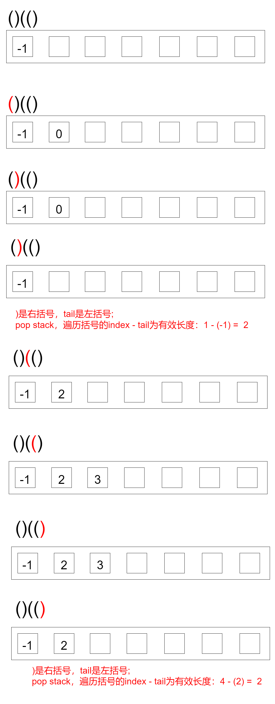

# 题目

给你一个只包含 `'('` 和 `')'` 的字符串，找出最长有效（格式正确且连续）括号子串的长度。

# 示例

```
输入：s = "(()"
输出：2
解释：最长有效括号子串是 "()"
```

```
输入：s = ")()())"
输出：4
解释：最长有效括号子串是 "()()"
```

```
输入：s = ""
输出：0
```

# 思路

和[有效的括号](https://github.com/9029HIME/Algorithm/tree/master/leetCode/20230103_EASY_20_Valid_Parentheses---Stack)有点类似，也是基于栈进行。区别是，有效的括号 是先匹配 再出栈。

而这道题需要 先匹配 再出栈 再算有效值，而且记录的不再是括号本身，而是**括号在字符串的下标**。

以"()(())"为例，画出流程图：



以"()(()"为例，画出流程图：



# 代码

