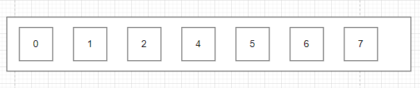
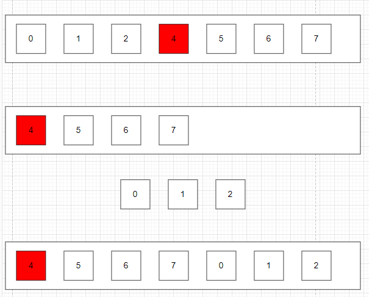
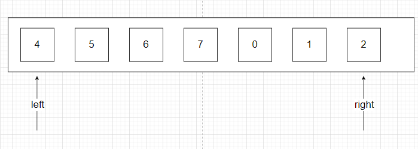
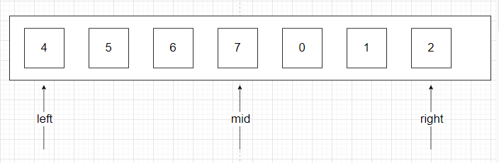
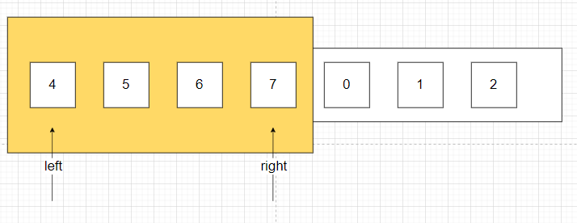
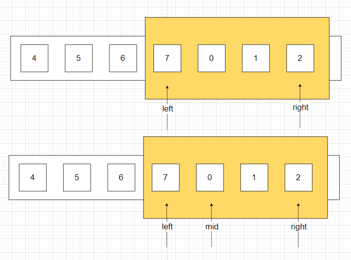

# 题目

整数数组 `nums` 按升序排列，数组中的值 **互不相同** 。

在传递给函数之前，`nums` 在预先未知的某个下标 `k`（`0 <= k < nums.length`）上进行了 **旋转**，使数组变为 `[nums[k], nums[k+1], ..., nums[n-1], nums[0], nums[1], ..., nums[k-1]]`（下标 **从 0 开始** 计数）。例如， `[0,1,2,4,5,6,7]` 在下标 `3` 处经旋转后可能变为 `[4,5,6,7,0,1,2]` 。

给你 **旋转后** 的数组 `nums` 和一个整数 `target` ，如果 `nums` 中存在这个目标值 `target` ，则返回它的下标，否则返回 `-1` 。

你必须设计一个时间复杂度为 `O(log n)` 的算法解决此问题。

# 示例

```
输入：nums = [4,5,6,7,0,1,2], target = 0
输出：4
```

```
输入：nums = [4,5,6,7,0,1,2], target = 3
输出：-1
```

```
输入：nums = [1], target = 0
输出：-1
```

# 思路

## 梳理题目

这道题目的描述非常打脑壳，看了很久才明白，我来梳理一下：



首先有这么一个有序数组，本来好好的。



突然选中了一个下标，比如3，即值=4的槽。以它为分界线，将两边的子数组进行了旋转、拼接，最终数组变成[4,5,6,7,0,1,2]（也有可能是[5,6,7,0,1,2,4]）。

然后，提供一个target值，要求从旋转后的数组里，找到这个target值的下标，如果没有，则返回-1。

## 思路

其实最简单粗暴的做法，就是遍历整个数组，如果发现值 = target，则返回该值的下标。

但是！题目要求，必须以O(logN)的时间复杂度完成，既然是O(logN)，首先就该想到是二分法了。

如果是连续有序，用二分法其实很简单，但题目里的数组，它是分段有序。数组被分成了两段，每一段都是连续有序的，但段与段之间是乱序的（比如[4,5,6,7]和[0,1,2]）。

像这种 **两段** 且 **分段有序** 的数组，能否进行二分呢？答案是可以的，具体步骤是：

1. 假设数组的起始下标 = left，末尾下标 = right。
2. 对 数组 进行 二分操作，找到数组的一个重点mid。
3. 此时数组被分成两个区间：[left,mid]、[mid,right]。
4. 对于 **两段** 且 **分段有序** 的数组，经过3.形成的两个区间，必定有一个区间是连续有序的。假设现在，这个连续有序的区间是[left,mid]。
5. 于是我对[left,mid]进行二分查找target，找到则返回下标，找不到则返回-1。
6. 如果5.返回-1，说明[left,mid]没有找到结果。于是我在[mid,right]这个区间 递归执行 从1.开始的操作。

这么说可能有点难以理解，还是画图吧，以[4,5,6,7,0,1,2]，target = 1为例：



初始状态下，left指向数组的0下标，right指向数组的尾下标。



通过 (left + right) / 2，找到nums的中点mid。此时[left,mid]和[mid,right]，这两个区间必定有一个是连续有序，另一个可能连续有序。此时[left,mid]连续有序，[mid,right]并非连续有序。



此时将 连续有序区间，即[left,mid]，也就是黄框部分，作为起点。进行二分查找寻找target，无非就两个结果：1. 找到并返回具体下标 2. 找不到并返回-1。很明显，对于这个用例，结果是-1。



于是我将另一个区间，即[mid,right]，也就是黄框部分作为 两段 且 分段连续 的数组，重新寻找其中点mid，重复刚才的流程。直到**找到target并返回下标** 或 **数组不可拆分并返回-1**。

## 要注意的2个临界case：

1. 找中点的临界case：

   有可能数组已经被拆分到[7]或[7,0]的程度，即 **只有1个数据** 或 **只有2个数据**。这时候就没必要找中点了，直接遍历数组里的值 是否 等于 target，如果不等于直接返回-1。 否则会引起**无限递归栈溢出**。

2. 二分查找的临界case：

   同样，有可能数组已经被拆分成 **只有1个数据** 或 **只有2个数据**的情况，这时候没必要进行二分，和中点case一样直接比较、返回即可。

# 代码

DoSearch函数：找中点，分隔区间，对其中一个区间进行二分，另一个区间继续找中点。

Dichotomy函数：二分数组，寻找target的下标，找不到则返回-1。

```go
package main

import "fmt"

func main() {
	// 二分查找的单元测试
	fmt.Println(Dichotomy([]int{1, 2, 3, 4, 5, 6, 7, 8, 9, 10}, 0, 6, 5))
	//  本题的测试用例
	fmt.Println(search([]int{4, 5, 6, 7, 0, 1, 2}, 0))
	fmt.Println(search([]int{4, 5, 6, 7, 0, 1, 2}, 3))
	fmt.Println(search([]int{1}, 0))
	fmt.Println(search([]int{1, 3, 5}, 2))
}

func search(nums []int, target int) int {
	return DoSearch(nums, target, 0, len(nums)-1)
}

/**
nums = 数组
target = 期望值
left = 二分的范围最小值
right = 二分的范围最大值
在这个函数中，会将nums以left和right为基础进行二分，其中一个区间必定有序，另外一个区间可能无序，也可能有序。
*/
func DoSearch(nums []int, target int, left int, right int) int {
	// 找中点的临界case（具体看思路）：
	if right == left+1 || left == right {
		if nums[left] == target {
			return left
		}
		if nums[right] == target {
			return right
		}
		return -1
	}

	mid := (left + right) / 2
	lV := nums[left]
	mV := nums[mid]
	nextLeft := 0
	nextRight := 0
	if lV <= mV {
		// 在左区间有序
		nextRight = right
		right = mid
		nextLeft = mid
	} else {
		// 在右区间有序
		nextLeft = left
		left = mid
		nextRight = mid
	}
	dichotomy := Dichotomy(nums, left, right, target)
	if dichotomy != -1 {
		return dichotomy
	}

	// 有序区间没有，继续doSearch无序区间
	return DoSearch(nums, target, nextLeft, nextRight)

}

/**
nums = 数组
left = 二分的范围最小值
right = 二分的范围最大值
target = 二分查找的值
return 值的下标
*/
func Dichotomy(nums []int, left int, right int, target int) int {
	// 二分查找的临界case（具体看思路）：
	if right == left+1 || left == right {
		if nums[left] == target {
			return left
		}
		if nums[right] == target {
			return right
		}
		return -1
	}
	mid := (left + right) / 2
	if nums[mid] == target {
		return mid
	}
	if nums[left] == target {
		return left
	}
	if nums[right] == target {
		return right
	}
	if nums[mid] < target && target < nums[right] {
		return Dichotomy(nums, mid, right, target)
	} else if nums[left] < target && target < nums[mid] {
		return Dichotomy(nums, left, mid, target)
	} else {
		return -1
	}
}
```