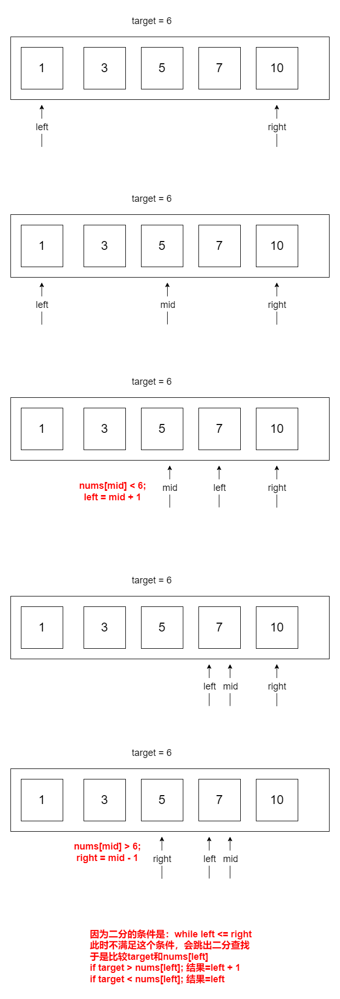

# 题目

给定一个排序数组和一个目标值，在数组中找到目标值，并返回其索引。如果目标值不存在于数组中，返回它将会被按顺序插入的位置。

请必须使用时间复杂度为 `O(log n)` 的算法。

# 示例

```
输入: nums = [1,3,5,6], target = 5
输出: 2
```

```
输入: nums = [1,3,5,6], target = 2
输出: 1
```

```
输入: nums = [1,3,5,6], target = 7
输出: 4
```

# 思路

O(log n)，优先考虑二分。

这题和普通二分查找索引不同的是，如果找不到，不再是返回-1了。

而是按照顺序，返回target在nums里应该存在的下标。

以nums = [1, 3, 5, 7, 10] , target = 6为例：



# 代码

```go
package main

import "fmt"

func main() {
	fmt.Println(searchInsert([]int{1, 3, 5, 7, 10}, 4))
}

func searchInsert(nums []int, target int) int {
	length := len(nums)
	left := 0
	right := length - 1
	// 边界处理
	if target < nums[left] {
		return left
	}
	if target > nums[right] {
		return length
	}

	for left <= right {
		mid := (right + left) / 2
		v := nums[mid]
		if target == v {
			return mid
		} else if target < v {
			right = mid - 1
		} else {
			left = mid + 1
		}
	}

	v := nums[left]
	if v < target {
		return left + 1
	} else {
		return left
	}
}
```