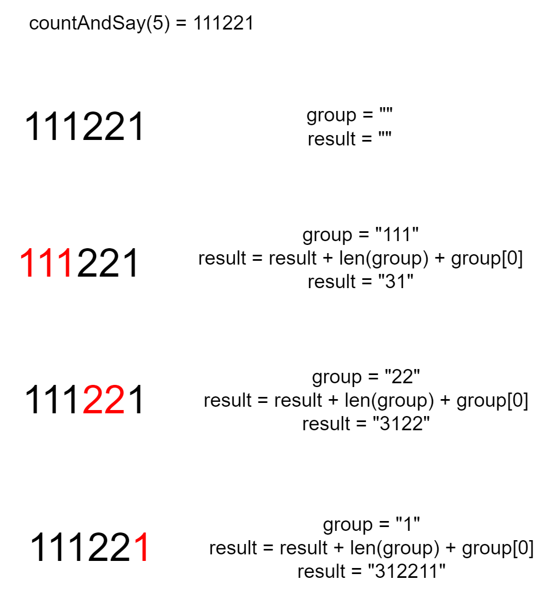

# 题目

给定一个正整数 `n` ，输出外观数列的第 `n` 项。

「外观数列」是一个整数序列，从数字 1 开始，序列中的每一项都是对前一项的描述。

你可以将其视作是由递归公式定义的数字字符串序列：

- `countAndSay(1) = "1"`
- `countAndSay(n)` 是对 `countAndSay(n-1)` 的描述，然后转换成另一个数字字符串。

前五项如下：

```
1.     1
2.     11
3.     21
4.     1211
5.     111221
第一项是数字 1 
描述前一项，这个数是 1 即 “ 一 个 1 ”，记作 "11"
描述前一项，这个数是 11 即 “ 二 个 1 ” ，记作 "21"
描述前一项，这个数是 21 即 “ 一 个 2 + 一 个 1 ” ，记作 "1211"
描述前一项，这个数是 1211 即 “ 一 个 1 + 一 个 2 + 二 个 1 ” ，记作 "111221"
```

# 示例

```
输入：n = 1
输出："1"
解释：这是一个基本样例。
```

```
输入：n = 4
输出："1211"
解释：
countAndSay(1) = "1"
countAndSay(2) = 读 "1" = 一 个 1 = "11"
countAndSay(3) = 读 "11" = 二 个 1 = "21"
countAndSay(4) = 读 "21" = 一 个 2 + 一 个 1 = "12" + "11" = "1211"
```

# 思路

很标准的递归题，递归出口是F(1) = 1，F(2) = 11。

以countAndSay(6)为例：



# 代码

```go
package main

import (
	"fmt"
	"strconv"
	"strings"
)

func main() {
	fmt.Println(countAndSay(1))
	fmt.Println(countAndSay(2))
	fmt.Println(countAndSay(3))
	fmt.Println(countAndSay(4))
	fmt.Println(countAndSay(5))
	fmt.Println(countAndSay(6))
}

func countAndSay(n int) string {
	if n == 1 {
		return "1"
	}
	if n == 2 {
		return "11"
	}
	if n > 2 {
		result := &strings.Builder{}
		previous := countAndSay(n - 1)
		// n个相同字符为一组group，分割previous
		element := ' '
		group := &strings.Builder{}
		for _, c := range previous {
			if element != ' ' && c != element {
				// 计算group结果，添加到result
				result.WriteString(strconv.Itoa(group.Len()))
				result.WriteRune(element)
				// 重置group
				group.Reset()
				element = c
				group.WriteRune(c)
			} else {
				element = c
				group.WriteRune(c)
			}
		}
		// 循环结束后，会有一组group未添加到result，这里补充上
		result.WriteString(strconv.Itoa(group.Len()))
		result.WriteRune(element)
		return result.String()
	}
	return "error"
}

```