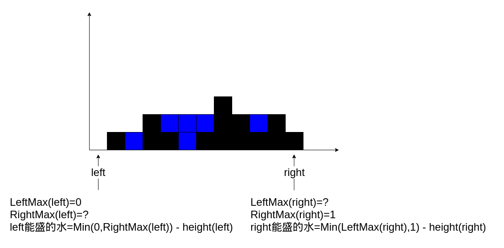

# 题目

给定 `n` 个非负整数表示每个宽度为 `1` 的柱子的高度图，计算按此排列的柱子，下雨之后能接多少雨水。

# 示例


```
输入：height = [0,1,0,2,1,0,1,3,2,1,2,1]
输出：6
解释：上面是由数组 [0,1,0,2,1,0,1,3,2,1,2,1] 表示的高度图，在这种情况下，可以接 6 个单位的雨水（蓝色部分表示雨水）。 
```

```
输入：height = [4,2,0,3,2,5]
输出：9
```

# 思路

## 公式推导

这道题有点类似之前做的 [盛最多水的容器](https://github.com/9029HIME/Algorithm/tree/master/leetCode/20221231_MEDIUM_11_Container_With_Most_Water---Double-Pointer)。区别是本题求整个区间的水容量。

能否转换一下思路呢？“求雨水的总量” 转换为 “求[数组每个下标能存放的雨水量] 的 总和”。

对于下标i来说，它能存放的雨水量该如何求？应该是 (i在左边的最大高度 与 i在右边的最大高度)取最小值 再减去 i的高度。

听起来有点绕口，假设LeftMax(i) = [0,i]区间的最大高度，RightMax(i) = [i,length - 1]区间的最大高度，那么**i的雨水量 = Min(LeftMax(i),RightMax(i)) - height(i)**。

## 怎么求？

以height = [0,1,0,2,1,0,1,3,2,1,2,1]为例：



**这道题最大的难点是：对于left来说，不知道RightMax的值。对于right来说，不知道LeftMax的值。**

## 突破口

但是，因为[left,length-1]的区间比[right,lenght-1]的区间大，所以leftRightMax肯定是 ≥ rightRightMax的。

同理，因为[0,right]的区间比[0,left]的区间大，所以rightLeftMax肯定是 ≥ leftLeftMax的。

这两个关系就是题目的突破口，对于left来说，如果leftLeftMax ＜ rightRightMax，则leftLeftMax 一定 ＜ leftRightMax。因为leftLeftMax ＜ rightRightMax ≤ leftRightMax。

同理，对于right来说，如果rightRightMax ≤ leftLeftMax，则rightRightMax 一定 ≤ rightLeftMax，因为rightRightMax ≤ leftLeftMax ≤ rightLeftMax。

所以，我只需判断leftMax和rightMax的值，如果≤，说明对于left来说能求出雨水容量，反之说明对于right来说能求出雨水容量。不管是哪个指针，只要求出了雨水容量，都向另外一方靠拢，直到双指针汇合，水的容量总和就能求出来。

# 代码

```go
package main

import "fmt"

func main() {
   fmt.Println(trap([]int{0, 1, 0, 2, 1, 0, 1, 3, 2, 1, 2, 1}))
   fmt.Println(trap([]int{4, 2, 0, 3, 2, 5}))
}

func trap(height []int) int {
   result := 0
   left := 0
   right := len(height) - 1
   leftMax := 0
   rightMax := 0
   for left < right {
      leftMax = Max(leftMax, height[left])
      rightMax = Max(rightMax, height[right])
      if leftMax < rightMax {
         // 对于left来说，leftLeftMax 必定 ＜ leftRightMax
         result = result + (leftMax - height[left])
         left++
      } else {
         //对于right来说,rightRightMax 必定 ≤ rightLeftMax
         result = result + (rightMax - height[right])
         right--
      }
   }
   return result
}

func Max(a int, b int) int {
   if a < b {
      return b
   }
   return a
}
```